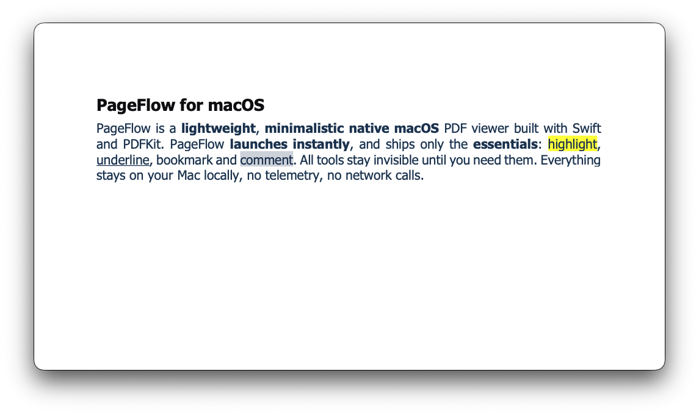

<div align="center">


# PageFlow

**An ultra-minimalistic, lightweight, native macOS PDF viewer**

[](https://github.com/pinchen147/PageFlow/stargazers)
[](LICENSE)
[](https://www.apple.com/macos/)



</div>

---

## Features

- **Pure SwiftUI + PDFKit** — Fast, native performance
- **Annotations** — Highlight, underline, and comment on PDFs
- **Bookmarks** — Mark, navigate, and preserve across undo
- **Tabs & Windows** — Multi-tab, multi-window, per-window undo isolation
- **Search** — Find text across your documents
- **Reading Position Memory** — Resume each PDF exactly where you left off — page, scroll, and zoom — across tab switches, reopen, and relaunch
- **Drag & Drop** — Drop one or many PDFs onto a window to open them as tabs
- **View Modes** — Single page, continuous, or two-up display
- **Liquid Glass UI** — Light, readable glass chrome for the tab bar, toolbar, and sidebars
- **Always on Top** — Per-window floating, toggled from Settings
- **Customizable Toolbar** — Resize, pin, and tune to taste
- **Auto-Updates** — Built-in update checking via Sparkle (direct-download builds)
- **Privacy First** — Fully offline, no telemetry

## What's New in 1.5.1

- **Window tear-off works again** — dragging a tab out of the bar reliably creates a new window (a macOS 26 change had silently broken it), and "Move to New Window" is back too.
- **Smoother tab dragging** — the drag pill now tracks the cursor without lag, and reordering doesn't stutter.
- **Warm tab switching, hardened** — switching tabs is instant, background tabs no longer intercept clicks or keyboard input, and your reading position survives long multi-tab sessions.
- **Stability** — fixes for comment editing, outline section export, and a markdown export edge case that could corrupt links.

## What's New in 1.5

- **Reading position memory** — PageFlow remembers where you left off in every PDF — current page, exact scroll position, and zoom — and restores it across tab switches, close/reopen, and relaunch.
- **Multi-file drag & drop** — Drop several PDFs onto a window at once and they open in order as tabs; a file already open is focused instead of duplicated.
- **Faster, smoother scrolling** — Thumbnails now render off the main thread, search is debounced into a single pass per keystroke burst, and zoom quality adapts during interactive zoom — noticeably less jank in large documents.
- **Steadier long sessions** — Per-tab views, scroll monitors, and PDF page caches are torn down on tab switch, fixing the gradual slowdown during long multi-tab sessions.
- **Accurate jumps to later pages** — Fixed a position drift when navigating to pages deep in a document.

## What's New in 1.4

- **Liquid Glass refresh** — tabs, toolbar, sidebars, and controls now use a lighter readable glass treatment.
- **Hover-reveal chrome** — the tab bar and toolbar stay out of the way and reveal on hover.
- **Smoother resizing** — PDF layout settling and stale view cleanup reduce resize lag and prevent delayed work from hitting old views.
- **More reliable PDF view modes** — display-mode changes now use one synchronization path, so menu changes and PDFKit updates stay in sync.
- **Cleaner tab architecture** — tab runtime ownership, click targets, sidebar state, and reorder state are split into focused components.
- **Better long-session stability** — stale PDF view references, unused scroll state, and delayed layout captures were cleaned up.

## Installation

Download the [latest release](https://pageflow.pinchen.me) or build from source:

```bash
git clone https://github.com/pinchen147/PageFlow.git
cd PageFlow
xcodebuild -project PageFlow.xcodeproj -scheme PageFlow -configuration Release build
```

## Keyboard Shortcuts

| Action | Shortcut |
|--------|----------|
| Open File | `⌘O` |
| New Tab | `⌘T` |
| Find | `⌘F` |
| Zoom In/Out | `⌘+` / `⌘-` |
| Next/Prev Page | `⌘↓` / `⌘↑` |
| Highlight | `⌘Y` |
| Underline | `⌘U` |
| Bookmark | `⌘D` |

## Requirements

- macOS 15 (Sequoia) or later

## License

[Apache 2.0](LICENSE)

---

<div align="center">
Made with SwiftUI
</div>
