# PageFlow Annotation System

A comprehensive deep-dive into the highlight, underline, comment, and bookmark features for AI coding agents.

---

## Overview

PageFlow supports four annotation types:

| Type | Manager | Persistence | Purpose |
|------|---------|-------------|---------|
| **Highlight** | AnnotationManager | PDFDocument | Mark important text with colored background |
| **Underline** | AnnotationManager | PDFDocument | Emphasize text with colored underline |
| **Comment** | CommentManager | PDFDocument + memory | Attach notes to text selections |
| **Bookmark** | BookmarkManager | UserDefaults | Mark pages for quick navigation |

**Key Files:**
- `Managers/AnnotationManager.swift` - Highlights and underlines
- `Managers/CommentManager.swift` - Text comments
- `Managers/BookmarkManager.swift` - Page bookmarks
- `Managers/SettingsManager.swift` - Color presets and persistence
- `Views/StablePDFView.swift` - Click/right-click handling
- `Views/PDFViewWrapper.swift` - Manager configuration and callbacks
- `Views/Settings/GeneralSettingsTab.swift` - Color customization UI
- `Config/DesignTokens.swift` - Default annotation colors

---

## Architecture

### Manager Dependency Graph


```mermaid
graph TD
    subgraph TabManager["TabManager (per tab)"]
        AM[AnnotationManager]
        CM[CommentManager]
        BM[BookmarkManager]
        PM[PDFManager]
    end

    AM -->|weak ref| PM
    CM -->|weak ref| PM
    BM -->|weak ref| PM

    subgraph PDFViewWrapper
        SP[selectionProvider closure]
    end

    AM -.->|configured with| SP
    CM -.->|configured with| SP

    subgraph StablePDFView
        AC[onAnnotationClick]
        AD[onAnnotationDeselect]
        AR[onAnnotationRemove]
    end

    AC --> AM
    AC --> CM
    AD --> AM
    AR --> AM

    style TabManager fill:#1a1a2e
    style PDFViewWrapper fill:#16213e
    style StablePDFView fill:#0f3460
```

### Persistence Strategy Overview


```mermaid
graph LR
    subgraph "Stored in PDFDocument"
        HL[Highlights]
        UL[Underlines]
        CH[Comment Highlights]
    end

    subgraph "Stored in UserDefaults"
        BK[Bookmarks]
    end

    subgraph "In Memory Only"
        CM_MODEL[CommentModel array]
        CM_MAP[highlights UUID map]
    end

    HL -->|PDFManager.save| PDF[PDF File]
    UL -->|PDFManager.save| PDF
    CH -->|PDFManager.save| PDF

    BK -->|JSONEncoder| UD[UserDefaults]

    CH -.->|reconstructed on load| CM_MODEL
    CH -.->|reconstructed on load| CM_MAP

    style PDF fill:#2d3436
    style UD fill:#636e72
```

---

## AnnotationManager Deep-Dive

**File:** `Managers/AnnotationManager.swift`
**Type:** `@Observable @MainActor final class`

### Class Diagram

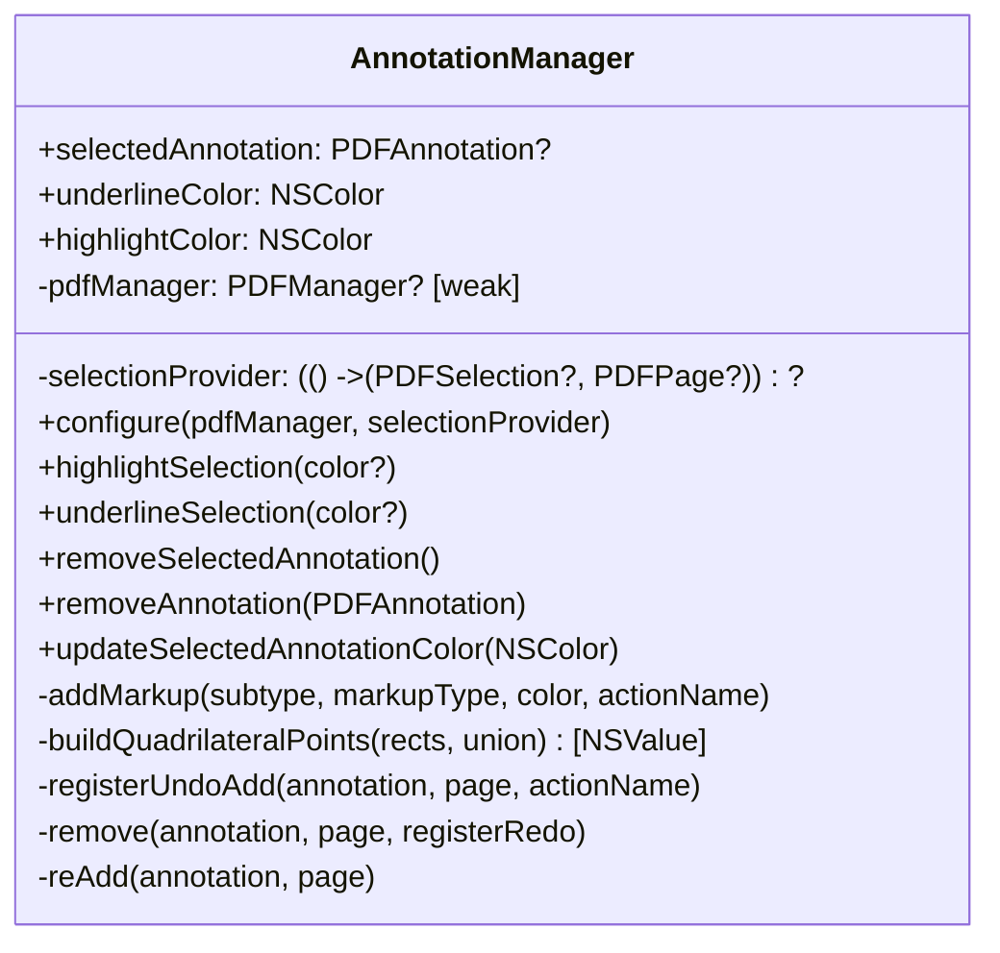
```mermaid
classDiagram
    class AnnotationManager {
        +selectedAnnotation: PDFAnnotation?
        +underlineColor: NSColor
        +highlightColor: NSColor
        -pdfManager: PDFManager? [weak]
        -selectionProvider: (() -> (PDFSelection?, PDFPage?))?
        +configure(pdfManager, selectionProvider)
        +highlightSelection(color?)
        +underlineSelection(color?)
        +removeSelectedAnnotation()
        +removeAnnotation(PDFAnnotation)
        +updateSelectedAnnotationColor(NSColor)
        -addMarkup(subtype, markupType, color, actionName)
        -buildQuadrilateralPoints(rects, union) [NSValue]
        -registerUndoAdd(annotation, page, actionName)
        -remove(annotation, page, registerRedo)
        -reAdd(annotation, page)
    }
```

### Properties

| Property | Type | Purpose |
|----------|------|---------|
| `selectedAnnotation` | `PDFAnnotation?` | Currently selected highlight/underline |
| `underlineColor` | `NSColor` | Default color for new underlines |
| `highlightColor` | `NSColor` | Default color for new highlights |
| `pdfManager` | `PDFManager?` (weak) | Reference to document state |
| `selectionProvider` | Closure | Gets current text selection from PDFView |

### Configuration

```
configure(pdfManager:selectionProvider:)
```
- Called from `PDFViewWrapper.makeNSView()`
- `pdfManager`: Used to set `isDirty` flag on changes
- `selectionProvider`: Closure returning `(PDFSelection?, PDFPage?)`

### Highlight/Underline Creation Flow

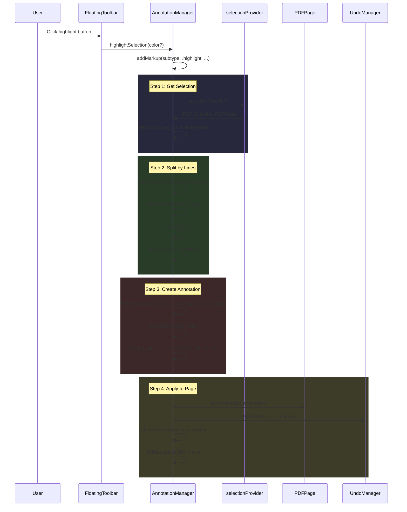
```mermaid
sequenceDiagram
    participant User
    participant FloatingToolbar
    participant AM as AnnotationManager
    participant SP as selectionProvider
    participant PDFPage
    participant UndoManager

    User->>FloatingToolbar: Click highlight button
    FloatingToolbar->>AM: highlightSelection(color?)

    AM->>AM: addMarkup(subtype: .highlight, ...)

    rect rgb(40, 40, 60)
        Note over AM: Step 1: Get Selection
        AM->>SP: selectionProvider()
        SP-->>AM: (PDFSelection, PDFPage)
        AM->>AM: selection.copy() as PDFSelection
    end

    rect rgb(40, 60, 40)
        Note over AM: Step 2: Split by Lines
        AM->>AM: selectionCopy.selectionsByLine()
        AM->>AM: Map to bounds(for: page)
        AM->>AM: Filter null/empty rects
        AM->>AM: Compute union rectangle
    end

    rect rgb(60, 40, 40)
        Note over AM: Step 3: Create Annotation
        AM->>AM: PDFAnnotation(bounds: union, forType: .highlight)
        AM->>AM: Set markupType, color
        AM->>AM: buildQuadrilateralPoints(lineRects, union)
    end

    rect rgb(60, 60, 40)
        Note over AM: Step 4: Apply to Page
        AM->>PDFPage: addAnnotation(annotation)
        AM->>UndoManager: registerUndo → remove()
        AM->>AM: selectedAnnotation = annotation
        AM->>AM: pdfManager.isDirty = true
    end
```

### The addMarkup() Algorithm

**Signature:**
```
private func addMarkup(subtype: PDFAnnotationSubtype, markupType: PDFMarkupType, color: NSColor, actionName: String)
```

**Step-by-step process:**

1. **Selection Extraction**
   - Call `selectionProvider()` to get current text selection
   - Copy selection to avoid mutation issues
   - Early return if no selection available

2. **Line Splitting**
   - Call `selection.selectionsByLine()` → `[PDFSelection]`
   - Map each line selection to `bounds(for: page)` → `[CGRect]`
   - Filter out null/empty rectangles
   - Compute union of all line rectangles
   - **Validate bounds** (width > 0, height > 0) - prevents invalid annotations

3. **Annotation Creation**
   - Create `PDFAnnotation(bounds: union, forType: subtype)`
   - Set `markupType` (determines rendering style)
   - Set `color`
   - Calculate `quadrilateralPoints` for precise line coverage

4. **Page Integration**
   - Call `page.addAnnotation(annotation)`
   - Register undo action
   - Set `selectedAnnotation`
   - Mark document dirty

### Quadrilateral Points Explained

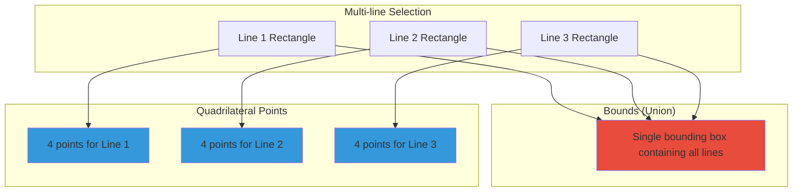
```mermaid
graph TD
    subgraph "Multi-line Selection"
        L1[Line 1 Rectangle]
        L2[Line 2 Rectangle]
        L3[Line 3 Rectangle]
    end

    subgraph "Bounds (Union)"
        U[Single bounding box containing all lines]
    end

    subgraph "Quadrilateral Points"
        Q1[4 points for Line 1]
        Q2[4 points for Line 2]
        Q3[4 points for Line 3]
    end

    L1 --> U
    L2 --> U
    L3 --> U

    L1 --> Q1
    L2 --> Q2
    L3 --> Q3

    style U fill:#e74c3c
    style Q1 fill:#3498db
    style Q2 fill:#3498db
    style Q3 fill:#3498db
```

**Why both bounds AND quadrilateralPoints?**
- `bounds`: Single rectangle enclosing all selected text
- `quadrilateralPoints`: Array of 4-point rectangles per line

**Without quadrilateralPoints:** Highlight would cover the entire union rectangle (including empty space between lines)

**With quadrilateralPoints:** PDFKit renders tight highlights following actual text flow

**Point Order (per line):**
1. Top-Left (TL)
2. Top-Right (TR)
3. Bottom-Left (BL)
4. Bottom-Right (BR)

**Coordinate System:**
- Points are relative to `union.origin`
- Formula: `point.x - union.minX`, `point.y - union.minY`

### buildQuadrilateralPoints Algorithm

**Input:** `rects: [CGRect]` (line rectangles), `union: CGRect` (bounding box)
**Output:** `[NSValue]` (array of CGPoint values)

```
For each rect in rects:
    TL = (rect.minX - union.minX, rect.maxY - union.minY)
    TR = (rect.maxX - union.minX, rect.maxY - union.minY)
    BL = (rect.minX - union.minX, rect.minY - union.minY)
    BR = (rect.maxX - union.minX, rect.minY - union.minY)
    Append [TL, TR, BL, BR] as NSValue points
```

### Color Management

**Default Colors (from DesignTokens):**
- `highlightYellow`: RGB(1.0, 1.0, 0.0)
- `highlightGreen`: RGB(0.0, 0.7, 0.258)
- `highlightRed`: RGB(0.824, 0.0, 0.0)
- `highlightBlue`: RGB(0.0, 0.447, 0.776)
- `underlineColor`: NSColor.black
- Underline also has yellow, green, red, blue variants

**updateSelectedAnnotationColor(color):**
1. Updates `annotation.color`
2. Updates manager's default color (for future annotations)
3. Marks document dirty
4. Registers undo (recursive call with previous color)

### Undo/Redo Pattern

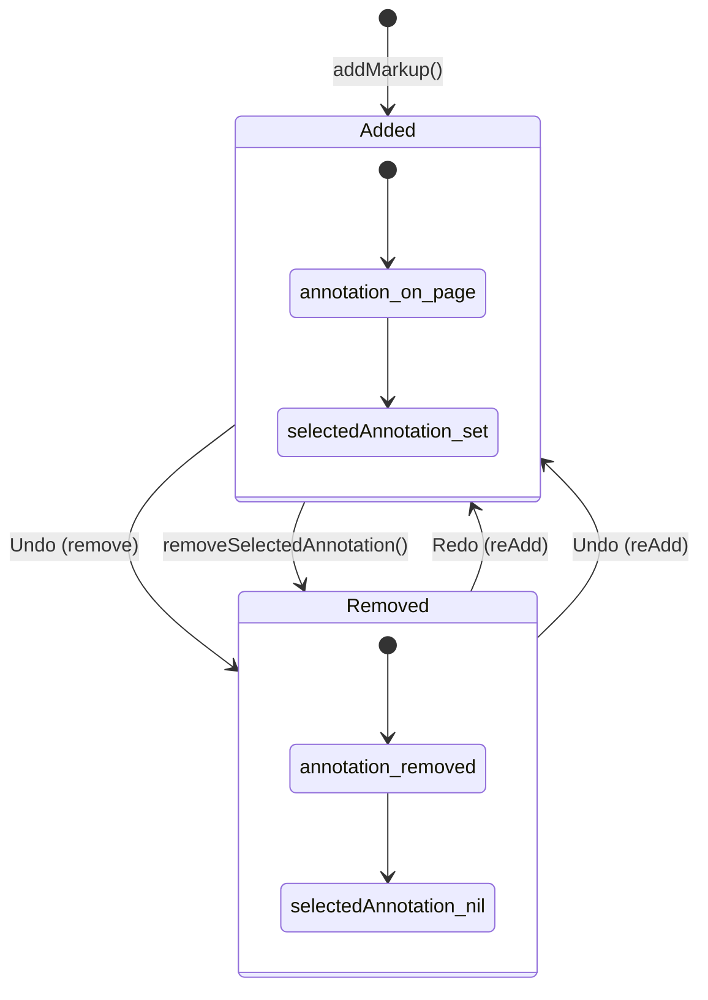
```mermaid
stateDiagram-v2
    [*] --> Added: addMarkup()

    Added --> Removed: Undo (remove)
    Removed --> Added: Redo (reAdd)
    Added --> Removed: removeSelectedAnnotation()
    Removed --> Added: Undo (reAdd)

    state Added {
        [*] --> annotation_on_page
        annotation_on_page --> selectedAnnotation_set
    }

    state Removed {
        [*] --> annotation_removed
        annotation_removed --> selectedAnnotation_nil
    }
```

**Registration Pattern:**
1. `registerUndoAdd()` → registers undo that calls `remove(registerRedo: true)`
2. `remove(registerRedo: true)` → registers undo that calls `reAdd()`
3. `reAdd()` → registers undo that calls `remove(registerRedo: true)`
4. Creates infinite undo/redo cycle

**Memory Safety:**
- Closures capture `[weak page]` to prevent memory leaks
- Guard ensures page still exists before operating
- Annotation kept strongly (needed for undo/redo to work)

---

## CommentManager Deep-Dive

**File:** `Managers/CommentManager.swift`
**Type:** `@Observable @MainActor final class`

### Class Diagram

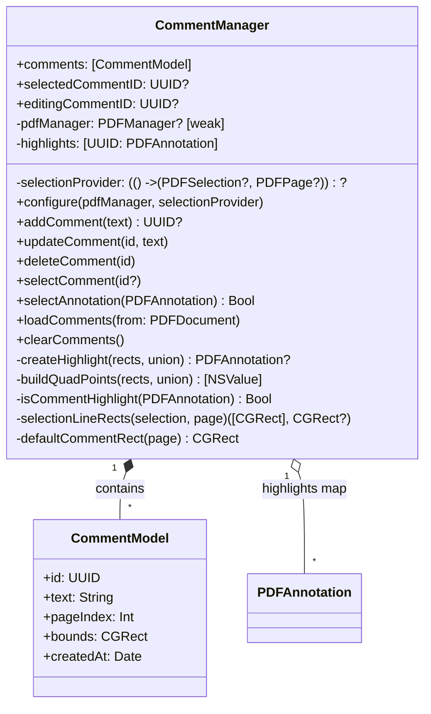
```mermaid
classDiagram
    class CommentManager {
        +comments: [CommentModel]
        +selectedCommentID: UUID?
        +editingCommentID: UUID?
        -pdfManager: PDFManager? [weak]
        -selectionProvider: (() -> (PDFSelection?, PDFPage?))?
        -highlights: [UUID: PDFAnnotation]
        +configure(pdfManager, selectionProvider)
        +addComment(text) UUID?
        +updateComment(id, text)
        +deleteComment(id)
        +selectComment(id?)
        +selectAnnotation(PDFAnnotation) Bool
        +loadComments(from: PDFDocument)
        +clearComments()
        -createHighlight(rects, union) PDFAnnotation?
        -buildQuadPoints(rects, union) [NSValue]
        -isCommentHighlight(PDFAnnotation) Bool
        -selectionLineRects(selection, page) ([CGRect], CGRect?)
        -defaultCommentRect(page) CGRect
    }

    class CommentModel {
        +id: UUID
        +text: String
        +pageIndex: Int
        +bounds: CGRect
        +createdAt: Date
    }

    CommentManager "1" *-- "*" CommentModel : contains
    CommentManager "1" o-- "*" PDFAnnotation : highlights map
```

### Comment-to-Highlight Linking Strategy

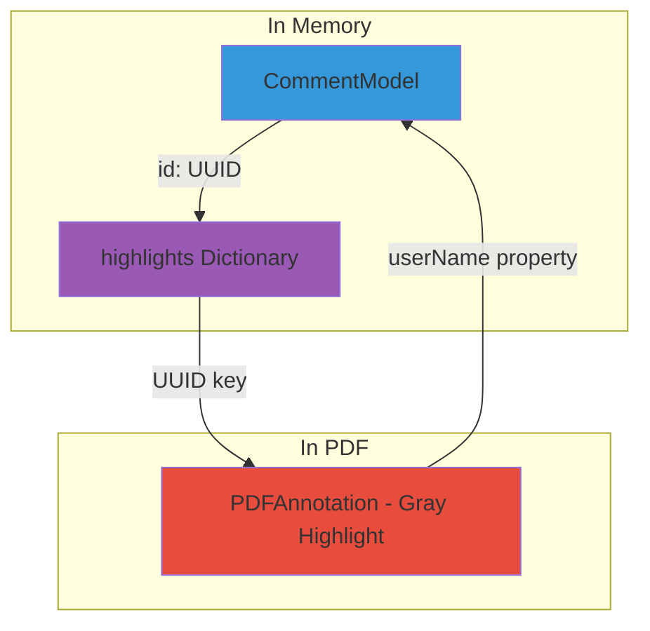
```mermaid
graph TD
    subgraph "In Memory"
        CM[CommentModel]
        HM[highlights Dictionary]
    end

    subgraph "In PDF"
        HA[PDFAnnotation - Gray Highlight]
    end

    CM -->|id: UUID| HM
    HM -->|UUID key| HA
    HA -->|userName property| CM

    style CM fill:#3498db
    style HM fill:#9b59b6
    style HA fill:#e74c3c
```

**Linking Mechanism:**
1. Create `CommentModel` with unique UUID
2. Create gray `PDFAnnotation` (highlight)
3. Store UUID in `annotation.userName`
4. Store comment text in `annotation.contents`
5. Map `UUID → PDFAnnotation` in `highlights` dictionary

**Why this approach?**
- PDFAnnotation persists with PDF file
- CommentModel can be reconstructed from annotation properties on load
- UUID in `userName` enables reverse lookup (annotation → comment)

### Add Comment Flow

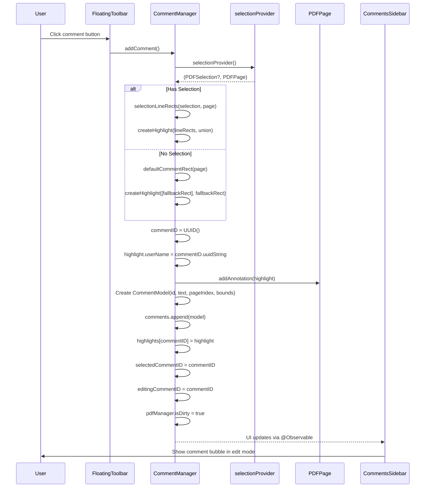
```mermaid
sequenceDiagram
    participant User
    participant FloatingToolbar
    participant CM as CommentManager
    participant SP as selectionProvider
    participant PDFPage
    participant Sidebar as CommentsSidebar

    User->>FloatingToolbar: Click comment button
    FloatingToolbar->>CM: addComment()

    CM->>SP: selectionProvider()
    SP-->>CM: (PDFSelection?, PDFPage)

    alt Has Selection
        CM->>CM: selectionLineRects(selection, page)
        CM->>CM: createHighlight(lineRects, union)
    else No Selection
        CM->>CM: defaultCommentRect(page)
        CM->>CM: createHighlight([fallbackRect], fallbackRect)
    end

    CM->>CM: commentID = UUID()
    CM->>CM: highlight.userName = commentID.uuidString
    CM->>PDFPage: addAnnotation(highlight)

    CM->>CM: Create CommentModel(id, text, pageIndex, bounds)
    CM->>CM: comments.append(model)
    CM->>CM: highlights[commentID] = highlight

    CM->>CM: selectedCommentID = commentID
    CM->>CM: editingCommentID = commentID
    CM->>CM: pdfManager.isDirty = true

    CM-->>Sidebar: UI updates via @Observable
    Sidebar->>User: Show comment bubble in edit mode
```

### Gray Highlight Identification

**isCommentHighlight(annotation) Algorithm:**

1. Check `annotation.type == "Highlight"`
2. Convert color to RGB color space
3. Extract RGBA components
4. Compare with `DesignTokens.commentHighlightColor` (gray, alpha 0.6)
5. Use tolerance: 0.1 for RGB, 0.15 for alpha
6. Return true if within tolerance

**Why color-based identification?**
- Distinguishes comment anchors from user highlights
- Comments use gray; highlights use yellow/green/red/blue
- Works across PDF save/load cycles

### Comment Loading Process

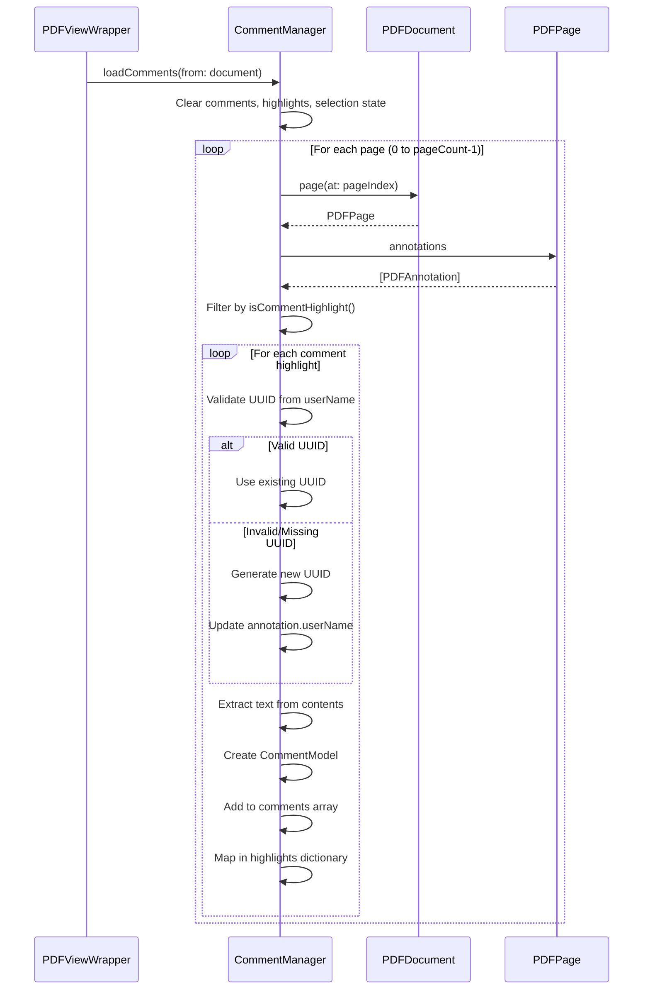
```mermaid
sequenceDiagram
    participant PVW as PDFViewWrapper
    participant CM as CommentManager
    participant DOC as PDFDocument
    participant Page as PDFPage

    PVW->>CM: loadComments(from: document)

    CM->>CM: Clear comments, highlights, selection state

    loop For each page (0 to pageCount-1)
        CM->>DOC: page(at: pageIndex)
        DOC-->>CM: PDFPage

        CM->>Page: annotations
        Page-->>CM: [PDFAnnotation]

        CM->>CM: Filter by isCommentHighlight()

        loop For each comment highlight
            CM->>CM: Validate UUID from userName
            alt Valid UUID
                CM->>CM: Use existing UUID
            else Invalid/Missing UUID
                CM->>CM: Generate new UUID
                CM->>CM: Update annotation.userName
            end
            CM->>CM: Extract text from contents
            CM->>CM: Create CommentModel
            CM->>CM: Add to comments array
            CM->>CM: Map in highlights dictionary
        end
    end
```

### CRUD Operations

| Operation | Method | Actions |
|-----------|--------|---------|
| **Create** | `addComment(text)` | Create highlight, create model, map UUID, set editing mode |
| **Read** | Via `comments` array | Iterate array, access by ID |
| **Update** | `updateComment(id, text)` | Find by ID, update text, mark dirty, register undo |
| **Delete** | `deleteComment(id)` | Remove highlight from page, remove from array, remove from map |

### Selection and Editing State

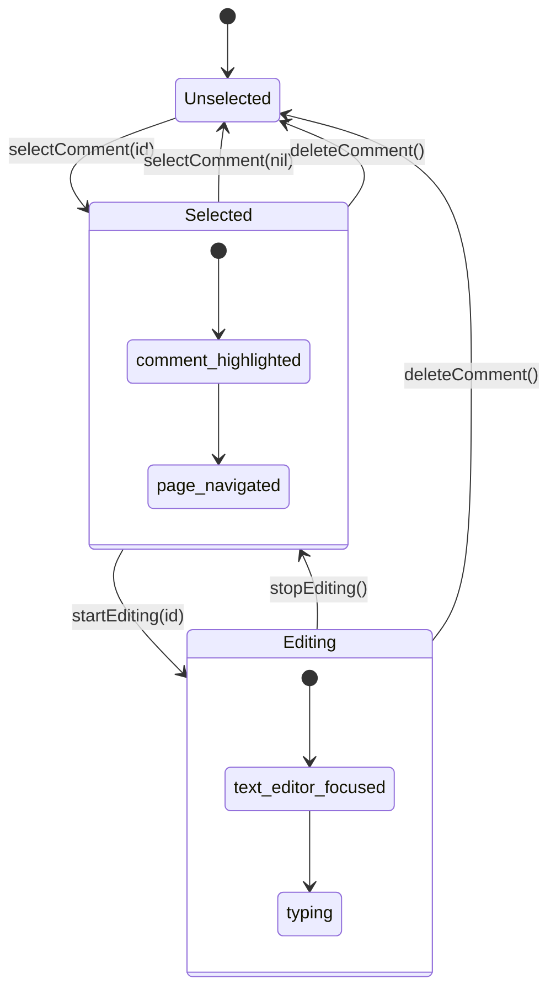
```mermaid
stateDiagram-v2
    [*] --> Unselected

    Unselected --> Selected: selectComment(id)
    Selected --> Unselected: selectComment(nil)

    Selected --> Editing: startEditing(id)
    Editing --> Selected: stopEditing()

    Editing --> Unselected: deleteComment()
    Selected --> Unselected: deleteComment()

    state Selected {
        [*] --> comment_highlighted
        comment_highlighted --> page_navigated
    }

    state Editing {
        [*] --> text_editor_focused
        text_editor_focused --> typing
    }
```

**State Variables:**
- `selectedCommentID`: Currently selected comment (visual highlight in sidebar)
- `editingCommentID`: Comment in edit mode (text field active)

---

## BookmarkManager Deep-Dive

**File:** `Managers/BookmarkManager.swift`
**Type:** `@Observable @MainActor final class`

### Class Diagram

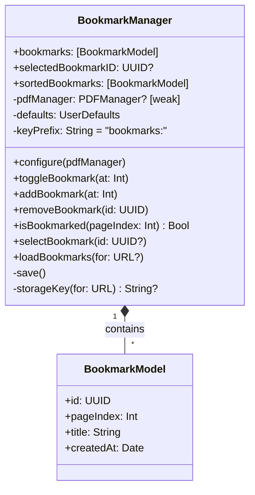
```mermaid
classDiagram
    class BookmarkManager {
        +bookmarks: [BookmarkModel]
        +selectedBookmarkID: UUID?
        +sortedBookmarks: [BookmarkModel]
        -pdfManager: PDFManager? [weak]
        -defaults: UserDefaults
        -keyPrefix: String = "bookmarks:"
        +configure(pdfManager)
        +toggleBookmark(at: Int)
        +addBookmark(at: Int)
        +removeBookmark(id: UUID)
        +isBookmarked(pageIndex: Int) Bool
        +selectBookmark(id: UUID?)
        +loadBookmarks(for: URL?)
        -save()
        -storageKey(for: URL) String?
    }

    class BookmarkModel {
        +id: UUID
        +pageIndex: Int
        +title: String
        +createdAt: Date
    }

    BookmarkManager "1" *-- "*" BookmarkModel : contains
```

### Toggle Logic

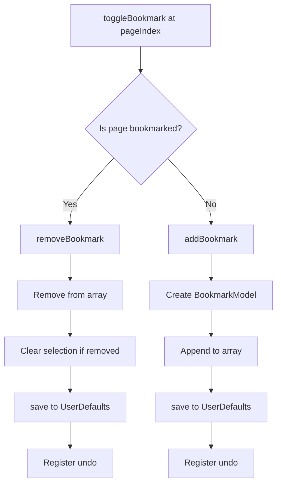
```mermaid
flowchart TD
    A[toggleBookmark at pageIndex] --> B{Is page bookmarked?}
    B -->|Yes| C[removeBookmark]
    B -->|No| D[addBookmark]

    C --> E[Remove from array]
    E --> F[Clear selection if removed]
    F --> G[save to UserDefaults]
    G --> H[Register undo]

    D --> I[Create BookmarkModel]
    I --> J[Append to array]
    J --> K[save to UserDefaults]
    K --> L[Register undo]
```

### UserDefaults Persistence

**Key Format:**
```
"bookmarks:" + URL.standardizedFileURL.path
```

**Example:**
```
bookmarks:/Users/john/Documents/thesis.pdf
```

**Value Format:** JSON-encoded `[BookmarkModel]`

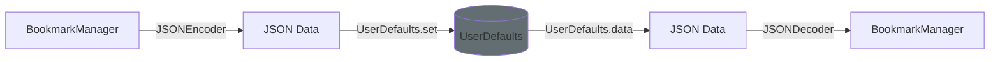
```mermaid
graph LR
    BM[BookmarkManager] -->|JSONEncoder| JSON[JSON Data]
    JSON -->|UserDefaults.set| UD[(UserDefaults)]

    UD -->|UserDefaults.data| JSON2[JSON Data]
    JSON2 -->|JSONDecoder| BM2[BookmarkManager]

    style UD fill:#636e72
```

### Load/Save Flow

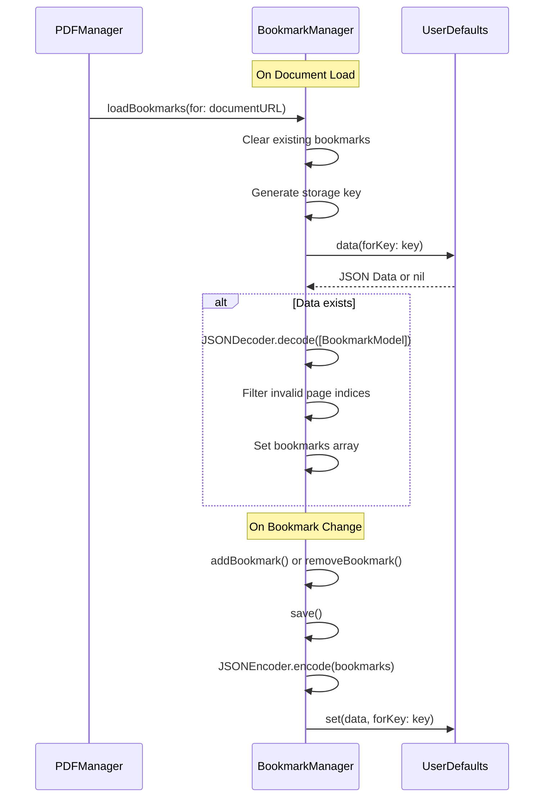
```mermaid
sequenceDiagram
    participant PM as PDFManager
    participant BM as BookmarkManager
    participant UD as UserDefaults

    Note over BM: On Document Load
    PM->>BM: loadBookmarks(for: documentURL)
    BM->>BM: Clear existing bookmarks
    BM->>BM: Generate storage key
    BM->>UD: data(forKey: key)
    UD-->>BM: JSON Data or nil

    alt Data exists
        BM->>BM: JSONDecoder.decode([BookmarkModel])
        BM->>BM: Filter invalid page indices
        BM->>BM: Set bookmarks array
    end

    Note over BM: On Bookmark Change
    BM->>BM: addBookmark() or removeBookmark()
    BM->>BM: save()
    BM->>BM: JSONEncoder.encode(bookmarks)
    BM->>UD: set(data, forKey: key)
```

### Navigation

**selectBookmark(id) Flow:**
1. Set `selectedBookmarkID`
2. Find bookmark by ID
3. Call `pdfManager.goToPage(bookmark.pageIndex)`
4. PDFManager navigates PDFView to page

---

## PDFKit Integration

### PDFAnnotation Creation

**Required Properties for Markup Annotations:**

| Property | Type | Purpose |
|----------|------|---------|
| `bounds` | `CGRect` | Overall bounding rectangle |
| `type` | `String` | Annotation subtype (e.g., "Highlight") |
| `markupType` | `PDFMarkupType` | Rendering style (.highlight, .underline) |
| `color` | `NSColor` | Fill/stroke color |
| `quadrilateralPoints` | `[NSValue]` | Precise coverage per line |

### Bounds vs QuadrilateralPoints Visual

```
┌─────────────────────────────────────────┐
│ BOUNDS (union rectangle)                │
│                                         │
│   ┌─────────────────────────────────┐   │
│   │ Line 1 (quadrilateral 1)        │   │
│   └─────────────────────────────────┘   │
│                                         │
│   ┌───────────────────────────┐         │
│   │ Line 2 (quadrilateral 2)  │         │
│   └───────────────────────────┘         │
│                                         │
│   ┌─────────────────────────────────┐   │
│   │ Line 3 (quadrilateral 3)        │   │
│   └─────────────────────────────────┘   │
│                                         │
└─────────────────────────────────────────┘

Without quadrilateralPoints: Entire bounds rectangle is highlighted
With quadrilateralPoints: Only the three line areas are highlighted
```

### Page Annotation Lifecycle

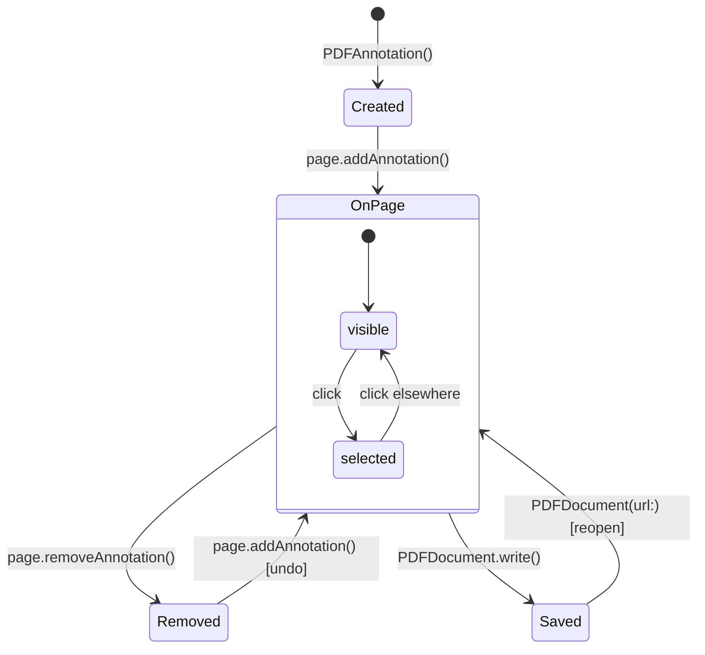
```mermaid
stateDiagram-v2
    [*] --> Created: PDFAnnotation()

    Created --> OnPage: page.addAnnotation()
    OnPage --> Removed: page.removeAnnotation()
    Removed --> OnPage: page.addAnnotation() [undo]

    OnPage --> Saved: PDFDocument.write()
    Saved --> OnPage: PDFDocument(url:) [reopen]

    state OnPage {
        [*] --> visible
        visible --> selected: click
        selected --> visible: click elsewhere
    }
```

### StablePDFView Interaction

**File:** `Views/StablePDFView.swift`

#### Click Handling

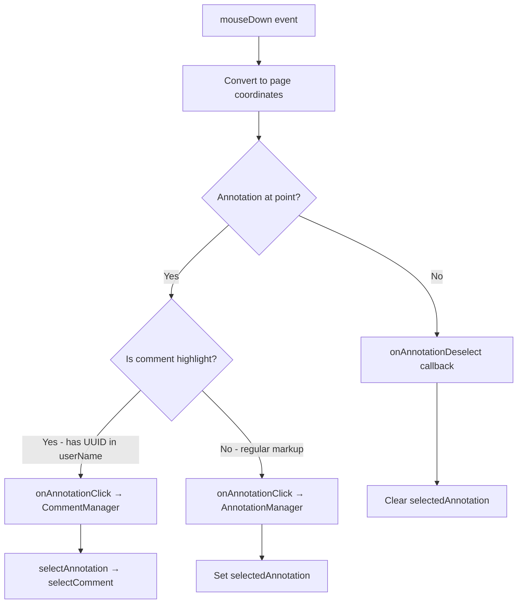
```mermaid
flowchart TD
    A[mouseDown event] --> B[Convert to page coordinates]
    B --> C{Annotation at point?}

    C -->|Yes| D{Is comment highlight?}
    C -->|No| E[onAnnotationDeselect callback]

    D -->|Yes - has UUID in userName| F[onAnnotationClick → CommentManager]
    D -->|No - regular markup| G[onAnnotationClick → AnnotationManager]

    E --> H[Clear selectedAnnotation]
    F --> I[selectAnnotation → selectComment]
    G --> J[Set selectedAnnotation]
```

#### Right-Click Context Menu

All annotation types (highlights, underlines, comments) support right-click context menus.

**Highlight/Underline Menu:**
```mermaid
flowchart TD
    A[rightMouseDown event] --> B[Convert to page coordinates]
    B --> C[findMarkupAnnotation at point]

    C --> D{Found annotation?}
    D -->|No| E[No menu]
    D -->|Yes| F{Is comment highlight?}

    F -->|Yes| G[buildCommentContextMenu]
    F -->|No| H[buildHighlightContextMenu]

    H --> I[Add "Remove" item]
    I --> I2[Add "Change Color" submenu]
    I2 --> J[popUp menu at click point]

    J --> K[User clicks item]
    K --> L[onAnnotationRemove / onColorChange callback]
```

**Comment Context Menu:**
```mermaid
flowchart TD
    G[buildCommentContextMenu] --> G1[Add "Remove Comment" item]
    G1 --> G2[Add "Change Color" submenu]
    G2 --> G3[For each color preset]
    G3 --> G4{Color matches annotation?}
    G4 -->|Yes| G5[Add checkmark state: .on]
    G4 -->|No| G6[No checkmark]
    G5 --> G7[popUp menu]
    G6 --> G7

    G7 --> G8[User clicks item]
    G8 --> G9[onCommentColorChange callback]
```

**Color Submenu Features:**
- Lists all presets from `SettingsManager`
- Checkmark indicates current color
- Direct color comparison (no alpha modification)

#### Annotation Hit Testing

**Two-step algorithm:**

1. **PDFKit built-in:** `page.annotation(at: point)`
2. **Tolerance-based fallback:** Search annotations within 10pt radius

**isRemovableMarkup(annotation) checks:**
- Type contains "highlight" or "underline"
- NOT a comment highlight (no UUID in userName)

### Callbacks

| Callback | Source | Handler |
|----------|--------|---------|
| `onAnnotationClick` | StablePDFView | PDFViewWrapper → CommentManager or AnnotationManager |
| `onAnnotationDeselect` | StablePDFView | PDFViewWrapper → AnnotationManager |
| `onAnnotationRemove` | StablePDFView | PDFViewWrapper → page.removeAnnotation |
| `onColorChange` | StablePDFView | PDFViewWrapper → annotation.color + undo |
| `onCommentColorChange` | StablePDFView | PDFViewWrapper → annotation.color + undo |

---

## UI Integration

### FloatingToolbar

**File:** `Views/FloatingToolbar.swift`


```mermaid
graph TD
    subgraph FloatingToolbar
        UB[Underline Button]
        HB[Highlight Button]
        CP[Color Picker]
        CB[Comment Button]
        BB[Bookmark Toggle]
    end

    UB -->|click| AM_U[annotationManager.underlineSelection]
    HB -->|click| AM_H[annotationManager.highlightSelection]
    CP -->|select| AM_C[annotationManager.highlightColor / underlineColor]
    CB -->|click| CM_A[commentManager.addComment]
    BB -->|click| BM_T[bookmarkManager.toggleBookmark]

    style FloatingToolbar fill:#2c3e50
```

**Color Palette (from SettingsManager presets):**
- Highlight: User-configurable (default: Yellow, Green, Red, Blue)
- Underline: User-configurable (default: Black, Yellow, Green, Red, Blue)
- Comments: User-configurable (default: Gray with 60% alpha)

### CommentsSidebar

**File:** `Views/CommentsSidebar.swift`

```mermaid
graph TD
    subgraph CommentsSidebar
        Header[Header - "Comments" + close button]
        List[ScrollView + LazyVStack]
    end

    subgraph CommentBubbleView
        Display[Display Mode - read only]
        Edit[Edit Mode - text editor]
        Actions[Edit / Delete buttons]
    end

    List --> CommentBubbleView

    Display -->|click| Select[commentManager.selectComment]
    Actions -->|edit click| StartEdit[commentManager.startEditing]
    Edit -->|Enter key| StopEdit[commentManager.stopEditing]
    Actions -->|delete click| Delete[commentManager.deleteComment]

    style CommentsSidebar fill:#34495e
    style CommentBubbleView fill:#2c3e50
```

**CommentBubbleView States:**
- Display: Shows text, selected state shows border
- Editing: CustomTextEditor (NSTextView wrapper)
- Enter commits, Shift+Enter adds newline

### SidebarView Bookmarks

**File:** `Views/SidebarView.swift`

```mermaid
graph TD
    subgraph SidebarView
        Tabs[Mode Toggle: Outline / Thumbnails / Bookmarks]
        Content[Content Area]
    end

    subgraph BookmarksMode
        Empty[Empty State - "No Bookmarks"]
        List[ForEach sortedBookmarks]
        Row[Bookmark Row - title + page + X button]
    end

    Tabs -->|select Bookmarks| Content
    Content --> BookmarksMode

    Row -->|click title| Select[bookmarkManager.selectBookmark → goToPage]
    Row -->|click X| Remove[bookmarkManager.removeBookmark]

    style SidebarView fill:#1e3a5f
    style BookmarksMode fill:#2e5077
```

### PDFViewWrapper Configuration

**File:** `Views/PDFViewWrapper.swift`

**makeNSView() setup:**

```mermaid
sequenceDiagram
    participant PVW as PDFViewWrapper
    participant SPV as StablePDFView
    participant AM as AnnotationManager
    participant CM as CommentManager

    PVW->>SPV: Create StablePDFView

    PVW->>AM: configure(pdfManager, selectionProvider)
    Note over AM: selectionProvider = { pdfView.currentSelection }

    PVW->>CM: configure(pdfManager, selectionProvider)
    Note over CM: selectionProvider = { pdfView.currentSelection ?? currentPage }

    PVW->>SPV: Set onAnnotationClick callback
    PVW->>SPV: Set onAnnotationDeselect callback
    PVW->>SPV: Set onAnnotationRemove callback
```

**Callback Wiring:**

```
onAnnotationClick:
    if commentManager.selectAnnotation(annotation) → comment selected
    else → annotationManager.selectedAnnotation = annotation

onAnnotationDeselect:
    annotationManager.selectedAnnotation = nil

onAnnotationRemove:
    page.removeAnnotation(annotation)
    pdfManager.isDirty = true
    Register undo
```

---

## Persistence Strategies

### Highlights & Underlines

```mermaid
flowchart LR
    subgraph "Runtime"
        AM[AnnotationManager]
        PA[PDFAnnotation on PDFPage]
    end

    subgraph "Persistence"
        PD[PDFDocument in memory]
        PDF[PDF File on disk]
    end

    AM -->|addAnnotation| PA
    PA -->|part of| PD
    PD -->|PDFDocument.write| PDF
    PDF -->|PDFDocument(url:)| PD

    style PDF fill:#27ae60
```

**Key Points:**
- Annotations are native PDFKit objects
- Stored directly in PDF file structure
- No separate persistence layer needed
- Loaded automatically when PDF reopens

### Comments

```mermaid
flowchart TD
    subgraph "Runtime"
        CM[CommentManager]
        Models[CommentModel array]
        Map[highlights UUID map]
        HA[Gray PDFAnnotation]
    end

    subgraph "PDF Storage"
        HA_USER[annotation.userName = UUID]
        HA_CONT[annotation.contents = text]
    end

    subgraph "Reconstruction on Load"
        SCAN[Scan all pages]
        FILTER[Filter by gray color]
        EXTRACT[Extract UUID + text]
        REBUILD[Rebuild CommentModel]
    end

    CM --> Models
    CM --> Map
    Map --> HA
    HA --> HA_USER
    HA --> HA_CONT

    SCAN --> FILTER
    FILTER --> EXTRACT
    EXTRACT --> REBUILD
    REBUILD --> Models
    REBUILD --> Map

    style HA fill:#e74c3c
```

**Storage in PDFAnnotation:**
- `userName`: UUID string (links to CommentModel)
- `contents`: Comment text (persisted in PDF)
- `color`: Gray with 0.6 alpha (identifies as comment)
- `bounds`: Selection rectangle

### Bookmarks

```mermaid
flowchart LR
    subgraph "Runtime"
        BM[BookmarkManager]
        Models[BookmarkModel array]
    end

    subgraph "UserDefaults"
        KEY["bookmarks:/path/to/file.pdf"]
        VALUE[JSON encoded array]
    end

    BM --> Models
    Models -->|JSONEncoder| VALUE
    VALUE -->|set| KEY

    KEY -->|data forKey| VALUE
    VALUE -->|JSONDecoder| Models

    style KEY fill:#636e72
```

**Key Format:** `"bookmarks:" + file path`

**Not stored in PDF because:**
- Bookmarks are user-specific (not document metadata)
- Different users may have different bookmarks for same PDF
- Faster read/write than modifying PDF

---

## Undo/Redo Patterns

### Recursive Registration Pattern

```mermaid
graph TD
    subgraph "Add Operation"
        A1[addMarkup] --> A2[page.addAnnotation]
        A2 --> A3[registerUndoAdd]
        A3 --> A4["registerUndo → remove()"]
    end

    subgraph "Undo (Remove)"
        R1[remove called by undo] --> R2[page.removeAnnotation]
        R2 --> R3["registerUndo → reAdd()"]
    end

    subgraph "Redo (Re-Add)"
        RA1[reAdd called by redo] --> RA2[page.addAnnotation]
        RA2 --> RA3["registerUndo → remove()"]
    end

    A4 -.->|undo| R1
    R3 -.->|undo/redo| RA1
    RA3 -.->|undo| R1

    style A1 fill:#27ae60
    style R1 fill:#e74c3c
    style RA1 fill:#3498db
```

### NSUndoManager Integration

**Getting UndoManager:**
```
NSApp.keyWindow?.undoManager
```

**Registration:**
```
undoManager.registerUndo(withTarget: self) { target in
    target.inverseOperation()
}
undoManager.setActionName("Action Name")
```

**Action Names:**
- "Add Highlight"
- "Add Underline"
- "Remove Annotation"
- "Change Annotation Color"
- "Add Comment"
- "Update Comment"
- "Delete Comment"
- "Add Bookmark"
- "Remove Bookmark"

---

## Design Tokens Reference

**File:** `Config/DesignTokens.swift`

### Color Architecture

All annotation colors are managed through `SettingsManager.swift` using **color presets**. This provides:
- User customization via Settings UI
- Persistence via UserDefaults
- Consistent sRGB color space across all comparisons

**Color Preset Format:**
- Highlights/Underlines: 6-char hex `#RRGGBB` (full alpha)
- Comments: 8-char hex `#RRGGBBAA` (alpha baked in)

### Highlight Colors (SettingsManager.defaultHighlightPresets)

| Name | Hex | RGB | Usage |
|------|-----|-----|-------|
| Yellow | `#FFFF00` | (1.0, 1.0, 0.0) | Default highlight |
| Green | `#00B342` | (0.0, 0.7, 0.258) | Green highlight |
| Red | `#D20000` | (0.824, 0.0, 0.0) | Red highlight |
| Blue | `#0072C6` | (0.0, 0.447, 0.776) | Blue highlight |

### Underline Colors (SettingsManager.defaultUnderlinePresets)

| Name | Hex | RGB | Usage |
|------|-----|-----|-------|
| Black | `#000000` | (0.0, 0.0, 0.0) | Default underline |
| Yellow | `#FFFF00` | (1.0, 1.0, 0.0) | Yellow underline |
| Green | `#00B342` | (0.0, 0.7, 0.258) | Green underline |
| Red | `#D20000` | (0.824, 0.0, 0.0) | Red underline |
| Blue | `#0072C6` | (0.0, 0.447, 0.776) | Blue underline |

### Comment Color (SettingsManager.defaultCommentPresets)

| Name | Hex | RGBA | Purpose |
|------|-----|------|---------|
| Gray | `#80808099` | (0.502, 0.502, 0.502, 0.6) | Default comment anchor |

**Note:** Comment colors use 8-char hex with alpha baked in (`0x99` = 153 = 0.6 alpha). This ensures:
- Color comparison (`isEqual`) works correctly
- No runtime alpha modification needed
- Consistency between preset and applied color

### DesignTokens.commentHighlightColor

```swift
// Must match default preset in SettingsManager (#80808099)
static let commentHighlightColor: NSColor = {
    let gray = CGFloat(0x80) / 255.0   // 0.502
    let alpha = CGFloat(0x99) / 255.0  // 0.6
    return NSColor(srgbRed: gray, green: gray, blue: gray, alpha: alpha)
}()
```

### Color Space Consistency

All colors use **sRGB color space** for reliable `isEqual(to:)` comparisons:
- `SettingsManager.hexToColor()` uses `NSColor(srgbRed:green:blue:alpha:)`
- `DesignTokens` constants use `NSColor(srgbRed:...)` or sRGB-equivalent
- Never mix calibrated RGB with sRGB (causes `isEqual` failures)

---

## Complete Data Flow Summary

### Highlight/Underline Creation

```
User selects text
    → FloatingToolbar button click
    → AnnotationManager.highlightSelection() / underlineSelection()
    → addMarkup(subtype, markupType, color)
    → selectionProvider() → PDFSelection
    → selectionsByLine() → [PDFSelection]
    → bounds(for: page) → [CGRect]
    → union() → CGRect
    → buildQuadrilateralPoints() → [NSValue]
    → PDFAnnotation(bounds:, forType:)
    → page.addAnnotation()
    → registerUndo()
    → pdfManager.isDirty = true
```

### Comment Creation

```
User selects text (optional)
    → FloatingToolbar comment button
    → CommentManager.addComment()
    → selectionProvider() → PDFSelection or nil
    → selectionLineRects() or defaultCommentRect()
    → createHighlight() → gray PDFAnnotation
    → highlight.userName = UUID
    → page.addAnnotation()
    → CommentModel created
    → comments.append()
    → highlights[id] = annotation
    → selectedCommentID = id
    → editingCommentID = id
    → pdfManager.isDirty = true
```

### Bookmark Toggle

```
User clicks bookmark button
    → BookmarkManager.toggleBookmark(at: pageIndex)
    → isBookmarked(pageIndex)?
        → Yes: removeBookmark() → remove from array → save() → registerUndo()
        → No: addBookmark() → create model → append → save() → registerUndo()
    → pdfManager.isDirty = true
```

---

## Robustness & Safety Patterns

### Bounds Validation (AnnotationManager)

Before creating annotations, bounds are validated to prevent invalid PDFKit state:

```swift
// In addMarkup() - prevents zero-area annotations
guard union.width > 0, union.height > 0 else { return }
```

### Color Space Guards (CommentManager)

The `isCommentHighlight()` function guards against color space conversion failures:

```swift
guard let target = DesignTokens.commentHighlightColor.usingColorSpace(.deviceRGB) else {
    return false
}
```

### UUID Validation on Load (CommentManager)

When loading comments from PDF, UUIDs are validated before use:

```swift
let existingUUID = highlight.userName.flatMap { UUID(uuidString: $0) }
let commentID = existingUUID ?? UUID()
if existingUUID == nil {
    // Only overwrite userName if it was invalid
    highlight.userName = commentID.uuidString
}
```

### Orphaned Comment Detection (CommentManager)

Debug builds detect comment-highlight mismatches:

```swift
if let highlight = highlights[id] {
    highlight.contents = text
} else {
    assertionFailure("Orphaned comment: highlight missing for ID \(id)")
}
```

### Weak References in Undo Closures (AnnotationManager)

To prevent memory leaks, page references in undo closures use weak capture:

```swift
undoManager.registerUndo(withTarget: self) { [weak page] target in
    MainActor.assumeIsolated {
        guard let page = page else { return }
        target.remove(annotation, from: page, registerRedo: true)
    }
}
```

### Race-Free Context Menus (StablePDFView)

Context menu actions use `representedObject` instead of instance variables to eliminate race conditions:

```swift
// Menu item stores annotation directly
removeItem.representedObject = annotation
colorItem.representedObject = (annotation, color)

// Action retrieves from sender (not instance variable)
@objc private func removeAnnotationAction(_ sender: NSMenuItem) {
    guard let annotation = sender.representedObject as? PDFAnnotation else { return }
    onAnnotationRemove?(annotation)
}
```

### Thread Safety

All managers use `@MainActor` to ensure thread-safe state mutations:
- `AnnotationManager` - `@Observable @MainActor final class`
- `CommentManager` - `@Observable @MainActor final class`
- `BookmarkManager` - `@Observable @MainActor final class`

Undo callbacks use `MainActor.assumeIsolated` to safely access @MainActor-isolated state.
