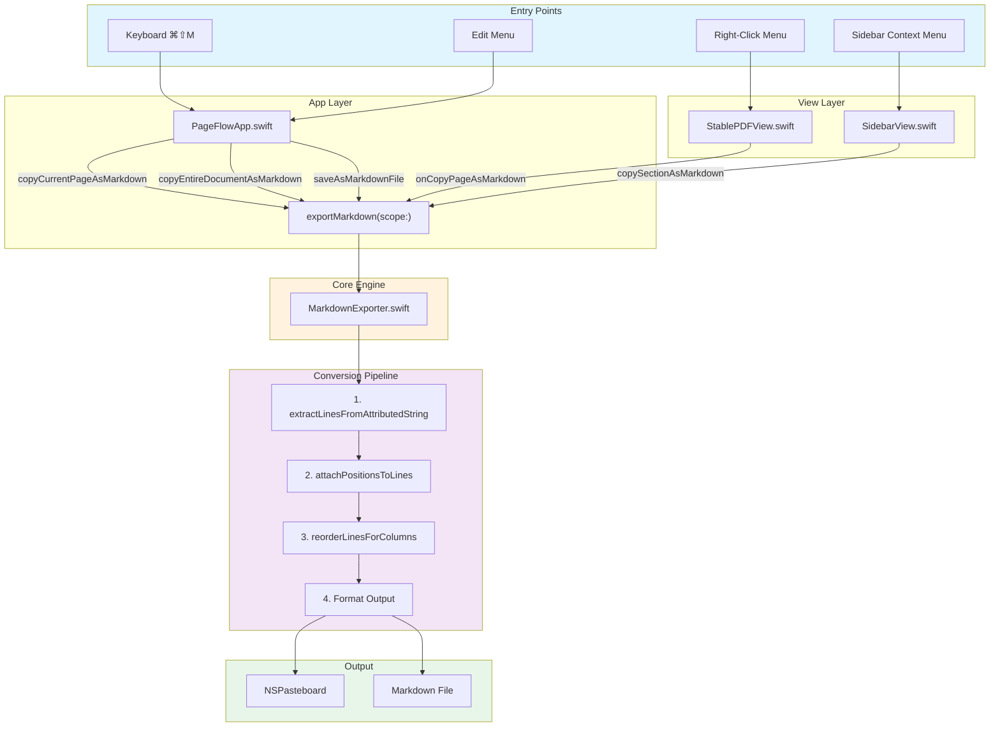
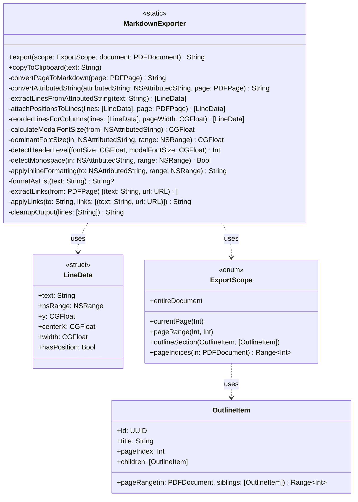
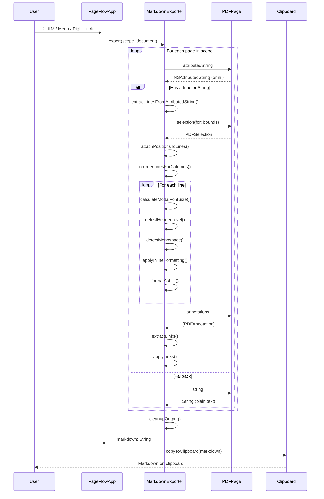
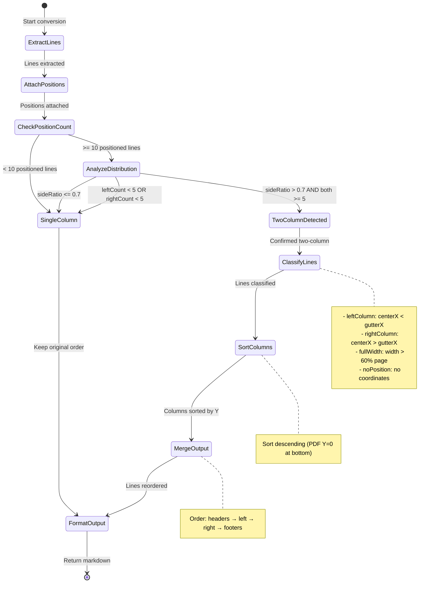
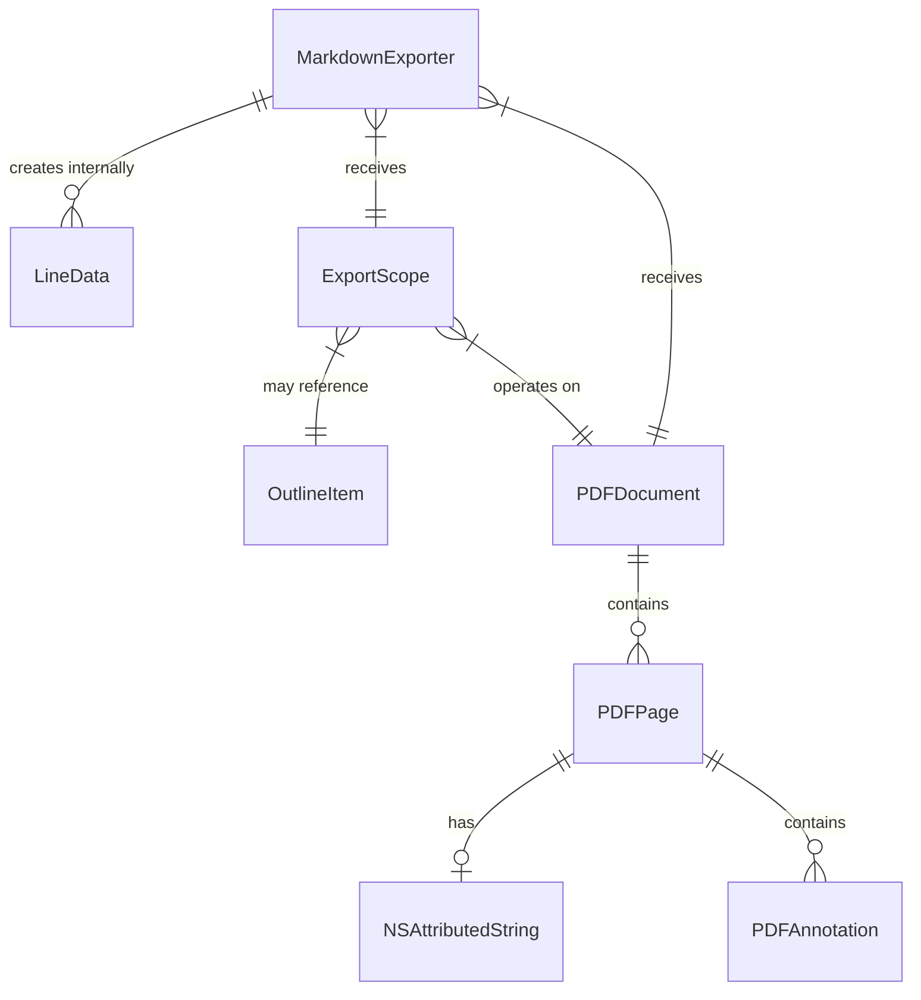

# PDF to Markdown (pdf2md) Architecture

## 1. Overview

**Feature**: Copy/Export PDF content as formatted Markdown
**Purpose**: Extract text from PDFs while preserving formatting (headers, bold, italic, lists, links, code blocks) and handling multi-column layouts
**Tech Stack**: Swift, PDFKit, NSAttributedString
**Entry Points**: Keyboard shortcut, Edit menu, right-click context menus
**Target**: macOS 14+ (Monterey)

### Core Principles

1. **AttributedString First**: Always prefer `PDFPage.attributedString` (rich formatting) over `PDFPage.string` (plain text)
2. **Graceful Degradation**: Position data enhances but never blocks conversion
3. **Best-Effort Multi-Column**: Detect and reorder two-column layouts when position data is available
4. **Single Pass**: Extract, analyze, and format in one pipeline

---

## 2. Visual Architecture

### 2.1 Component Hierarchy



### 2.2 Class Diagram



### 2.3 Conversion Pipeline Sequence



### 2.4 Multi-Column Detection State Machine



---

## 3. File Organization

```
PageFlow/
├── Utilities/
│   └── MarkdownExporter.swift         Core conversion engine (425 lines)
├── Models/
│   ├── ExportScope.swift              Export scope enum with pageIndices()
│   └── OutlineItem.swift              Outline/bookmark structure
├── Views/
│   ├── PDFViewWrapper.swift:71-81     Sets up onCopyPageAsMarkdown callback
│   ├── StablePDFView.swift:474-597    Right-click menu implementation
│   └── SidebarView.swift:190-206      Outline context menu
└── PageFlowApp.swift:177-198,465-506  App-level commands and keyboard shortcuts
```

---

## 4. Core Components Reference

### 4.1 MarkdownExporter

- **File**: `PageFlow/Utilities/MarkdownExporter.swift`
- **Type**: Static utility class
- **Purpose**: Convert PDF pages to formatted Markdown text

#### Public API

| Method | Signature | Purpose |
|--------|-----------|---------|
| `export` | `(scope: ExportScope, document: PDFDocument) -> String` | Main entry point for conversion |
| `copyToClipboard` | `(text: String) -> Void` | Place text on system clipboard |

#### Key Private Methods

| Method | Lines | Purpose |
|--------|-------|---------|
| `convertPageToMarkdown` | 35-43 | Single page conversion dispatcher |
| `convertAttributedString` | 56-106 | 4-stage pipeline orchestrator |
| `extractLinesFromAttributedString` | 108-126 | Stage 1: Split text into LineData |
| `attachPositionsToLines` | 130-164 | Stage 2: Add spatial coordinates |
| `reorderLinesForColumns` | 168-240 | Stage 3: Multi-column detection/reorder |
| `calculateModalFontSize` | 293-303 | Find most common font size |
| `dominantFontSize` | 279-291 | Get font size for specific range |
| `detectHeaderLevel` | 264-275 | Map font ratio to H1-H6 |
| `detectMonospace` | 305-324 | Check for code block fonts |
| `applyInlineFormatting` | 328-355 | Add **bold** and *italic* markers |
| `formatAsList` | 362-375 | Detect and format list items |
| `extractLinks` | 399-415 | Get PDF annotation links |
| `applyLinks` | 417-424 | Convert to markdown links |
| `cleanupOutput` | 379-395 | Remove excessive blank lines |

#### Dependencies

- `PDFKit` - PDF document/page access
- `Foundation` - NSAttributedString, NSRange, regex

---

### 4.2 ExportScope

- **File**: `PageFlow/Models/ExportScope.swift`
- **Type**: `enum ExportScope`
- **Purpose**: Define which pages to include in export

#### Cases

| Case | Associated Values | Description |
|------|-------------------|-------------|
| `currentPage` | `Int` (page index) | Single page |
| `pageRange` | `Int, Int` (start, end) | Range of pages |
| `outlineSection` | `OutlineItem, [OutlineItem]` | Outline section with siblings |
| `entireDocument` | - | All pages |

#### Key Method

```swift
func pageIndices(in document: PDFDocument) -> Range<Int>
```

Returns clamped page range for any scope type.

---

### 4.3 LineData (Internal)

- **File**: `PageFlow/Utilities/MarkdownExporter.swift:45-52`
- **Type**: `private struct LineData`
- **Purpose**: Track line content and position for column detection

#### Properties

| Property | Type | Default | Purpose |
|----------|------|---------|---------|
| `text` | `String` | - | Line content |
| `nsRange` | `NSRange` | - | Range in original attributedString |
| `y` | `CGFloat` | `0` | PDF Y coordinate (0 at bottom) |
| `centerX` | `CGFloat` | `0` | Horizontal center position |
| `width` | `CGFloat` | `0` | Line width in points |
| `hasPosition` | `Bool` | `false` | Whether position was determined |

---

## 5. Data Models

### 5.1 Model Relationships



### 5.2 Data Flow

```
PDFDocument
    └── PDFPage[]
            ├── attributedString: NSAttributedString
            │       └── Contains: text + font attributes + traits
            ├── string: String (fallback plain text)
            ├── annotations: [PDFAnnotation]
            │       └── Link annotations with URL actions
            └── selection(for: CGRect): PDFSelection
                    └── selectionsByLine(): [PDFSelection]
                            └── bounds(for: PDFPage): CGRect
```

---

## 6. Key Patterns

### 6.1 Text Extraction Strategy

```
┌─────────────────────────────────────────────────────────┐
│ PDFPage.attributedString (PREFERRED)                     │
│   ├── Rich formatting (fonts, traits)                    │
│   ├── Enables header detection (font size)               │
│   ├── Enables bold/italic detection (traits)             │
│   └── Enables code block detection (monospace font)      │
├─────────────────────────────────────────────────────────┤
│ PDFPage.string (FALLBACK)                                │
│   ├── Plain text only                                    │
│   ├── No formatting preserved                            │
│   └── Used when attributedString unavailable/empty       │
└─────────────────────────────────────────────────────────┘
```

### 6.2 Header Detection Algorithm

Font size ratio determines heading level:

| Ratio (line/modal) | Header Level | Markdown |
|--------------------|--------------|----------|
| > 1.50 | H1 | `#` |
| > 1.35 | H2 | `##` |
| > 1.20 | H3 | `###` |
| > 1.10 | H4 | `####` |
| > 1.05 | H5 | `#####` |
| > 1.00 | H6 | `######` |
| ≤ 1.00 | Body | (none) |

**Modal font size**: Most common font size in document (weighted by character count)

### 6.3 Multi-Column Detection Thresholds

```swift
// Detection thresholds
let leftThreshold = pageWidth * 0.35
let rightThreshold = pageWidth * 0.65
let gutterX = pageWidth / 2

// Classification criteria
- leftColumn: centerX < gutterX && width < pageWidth * 0.6
- rightColumn: centerX > gutterX && width < pageWidth * 0.6
- fullWidth: width > pageWidth * 0.6

// Confirmation criteria (ALL must be true)
- linesWithPosition >= 10
- sideRatio > 0.7  // (leftCount + rightCount) / total
- leftCount >= 5
- rightCount >= 5
```

### 6.4 List Detection Patterns

```swift
// Compiled regex patterns (Lines 360-361)
private static let unorderedListPattern = try! NSRegularExpression(
    pattern: #"^[-*•–—]\s+"#
)
private static let orderedListPattern = try! NSRegularExpression(
    pattern: #"^\d+\.\s+"#
)
```

| Input | Detected As | Output |
|-------|-------------|--------|
| `- Item` | Unordered | `- Item` |
| `* Item` | Unordered | `- Item` |
| `• Item` | Unordered | `- Item` |
| `1. Item` | Ordered | `1. Item` |

### 6.5 Monospace Font Keywords

```swift
// Triggers code block wrapping (Line 315)
let keywords = ["mono", "courier", "menlo", "consolas",
                "source code", "fira code"]
```

Line is treated as code if >50% of characters use monospace font.

---

## 7. Integration Points

### 7.1 Entry Point Callbacks

| Location | Callback/Action | Target |
|----------|-----------------|--------|
| `PageFlowApp.swift:177` | Keyboard `⌘⇧M` | `copyCurrentPageAsMarkdown()` |
| `PageFlowApp.swift:183-198` | Edit menu items | Various export methods |
| `StablePDFView.swift:85` | `onCopyPageAsMarkdown` closure | Set by PDFViewWrapper |
| `SidebarView.swift:190` | Button action | `copySectionAsMarkdown()` |

### 7.2 Callback Setup (PDFViewWrapper)

```swift
// PDFViewWrapper.swift:71-81
pdfView.onCopyPageAsMarkdown = { [weak pdfManager] in
    guard let pdfManager = pdfManager,
          let document = pdfManager.document else { return }

    let markdown = MarkdownExporter.export(
        scope: .currentPage(pdfManager.currentPageIndex),
        document: document
    )
    guard !markdown.isEmpty else { return }
    MarkdownExporter.copyToClipboard(markdown)
}
```

### 7.3 Right-Click Menu Setup (StablePDFView)

```swift
// StablePDFView.swift:474-480
let copyMDItem = NSMenuItem(
    title: "Copy Page as Markdown",
    action: #selector(copyPageAsMarkdownAction),
    keyEquivalent: ""
)
copyMDItem.target = self
menu.addItem(copyMDItem)
```

---

## 8. Markdown Features Matrix

| Feature | Supported | Detection Method |
|---------|-----------|------------------|
| Headers (H1-H6) | ✅ | Font size ratio vs modal |
| **Bold** | ✅ | `NSFont.symbolicTraits.bold` |
| *Italic* | ✅ | `NSFont.symbolicTraits.italic` |
| ***Bold+Italic*** | ✅ | Combined traits |
| Unordered Lists | ✅ | Regex: `^[-*•–—]\s+` |
| Ordered Lists | ✅ | Regex: `^\d+\.\s+` |
| Code Blocks | ✅ | Monospace font detection |
| Links | ✅ | PDF annotation extraction |
| Multi-Column | ✅ | Position-based reordering |
| Page Breaks | ✅ | `---` separator |
| Inline Code | ❌ | - |
| Tables | ❌ | - |
| Images | ❌ | - |
| Footnotes | ❌ | - |

---

## 9. Performance Characteristics

| Operation | Complexity | Notes |
|-----------|------------|-------|
| Text extraction | O(n) | n = characters per page |
| Line splitting | O(n) | Single pass |
| Position attachment | O(n·m) | n = lines, m = selections (text matching) |
| Column detection | O(n) | n = positioned lines |
| Font analysis | O(n·a) | a = attribute ranges per line |
| Link extraction | O(a) | a = annotations (typically small) |
| Multi-page export | O(p·n) | p = pages, n = avg chars/page |

**Bottleneck**: Position attachment uses O(n·m) text matching.

---

## 10. Error Handling

| Scenario | Handling |
|----------|----------|
| Empty PDF | Returns empty string |
| `attributedString` nil | Falls back to `PDFPage.string` |
| Position data unavailable | Skips column reordering |
| < 10 positioned lines | Skips column reordering |
| Font size unavailable | Defaults to 12pt |
| Link text not found | Link silently not applied |
| Duplicate link text | Only first occurrence replaced |

---

## 11. Extension Points

### Adding New Markdown Features

1. **Inline formatting**: Add detection in `applyInlineFormatting()` (Line 328)
2. **Block elements**: Add detection in format loop (Lines 72-106)
3. **List types**: Add regex patterns (Line 360-361)
4. **New export scopes**: Add case to `ExportScope` enum

### Customizing Detection

1. **Header thresholds**: Modify ratios in `detectHeaderLevel()` (Line 264)
2. **Column thresholds**: Modify percentages in `reorderLinesForColumns()` (Line 170)
3. **Monospace fonts**: Add keywords to detection list (Line 315)

---

## 12. Testing Considerations

### Unit Test Targets

| Component | Test Focus |
|-----------|------------|
| `extractLinesFromAttributedString` | Line splitting edge cases |
| `detectHeaderLevel` | Font ratio calculations |
| `detectMonospace` | Font name matching |
| `formatAsList` | Regex pattern matching |
| `reorderLinesForColumns` | Column detection accuracy |
| `cleanupOutput` | Blank line normalization |

### Integration Test Scenarios

1. Single-column PDF → preserves reading order
2. Two-column academic paper → reorders left-then-right
3. PDF with links → converts to markdown links
4. PDF with code blocks → wraps in triple backticks
5. Mixed formatting → correctly nests bold/italic
6. Empty page → returns empty string gracefully

---

## 13. Known Limitations

1. **Two-Column Layout**: Requires ≥10 positioned lines; may fail on complex multi-column layouts (3+ columns)
2. **Position Matching**: Uses text matching which may fail with duplicate line content
3. **Tables**: Rendered as plain text, no cell structure preserved
4. **OCR**: No support for scanned PDFs without embedded text
5. **Images**: Not extracted or referenced
6. **Link Duplicates**: Only first occurrence of duplicate link text is converted

---

## 14. Quick Reference

### Keyboard Shortcuts

| Shortcut | Action |
|----------|--------|
| `⌘⇧M` | Copy current page as Markdown |

### Menu Paths

| Path | Action |
|------|--------|
| Edit → Export as Markdown → Current Page | Copy current page |
| Edit → Export as Markdown → Entire Document | Copy all pages |
| Edit → Export as Markdown → Save to File… | Save as .md file |

### Context Menus

| Location | Right-Click On | Action |
|----------|----------------|--------|
| PDF View | Page background | Copy Page as Markdown |
| Sidebar | Outline item | Copy Section as Markdown |
