# PageFlow Window & Tab System

A comprehensive deep-dive into the multi-window, multi-tab architecture for AI coding agents.

---

## Overview

PageFlow supports:
- **Multiple windows** - Each window is independent
- **Multiple tabs per window** - Browser-style tabbed interface
- **Per-tab state isolation** - Each tab has its own managers
- **State restoration** - Tab state persisted across switches

**Key Files:**
- `PageFlowApp.swift` - App entry point, WindowGroup, menu commands
- `AppDelegate.swift` - App lifecycle, quit prompts
- `Views/TabContainerView.swift` - Per-window root container
- `Views/TabBarView.swift` - Tab bar UI
- `Views/TabItemView.swift` - Individual tab button
- `Managers/TabManager.swift` - Tab state management
- `Managers/WindowRegistry.swift` - Global window tracking
- `Models/TabModel.swift` - Tab data model
- `Config/FocusedValues.swift` - Per-window state for menus

---

## Architecture

### Window Hierarchy


```mermaid
graph TD
    subgraph App["PageFlowApp (@main)"]
        AD[AppDelegate]
        WR[WindowRegistry.shared]
        MC[Menu Commands]
    end

    subgraph Window1["Window 1"]
        TCV1[TabContainerView]
        TM1["@State TabManager"]

        subgraph Tabs1["Tabs"]
            T1A["Tab A<br/>PDFManager + SearchManager + ..."]
            T1B["Tab B<br/>PDFManager + SearchManager + ..."]
        end
    end

    subgraph Window2["Window 2"]
        TCV2[TabContainerView]
        TM2["@State TabManager"]

        subgraph Tabs2["Tabs"]
            T2A["Tab C<br/>PDFManager + SearchManager + ..."]
        end
    end

    App --> Window1
    App --> Window2
    AD --> WR
    WR -->|tracks| TM1
    WR -->|tracks| TM2
    TCV1 --> TM1
    TCV2 --> TM2
    TM1 --> Tabs1
    TM2 --> Tabs2

    MC -.->|FocusedValues| TM1
    MC -.->|FocusedValues| TM2

    style App fill:#1a1a2e
    style Window1 fill:#16213e
    style Window2 fill:#16213e
```

### Component Relationships

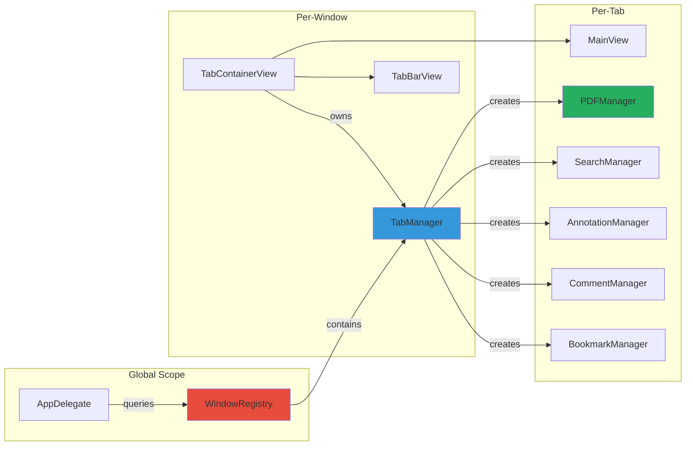
```mermaid
graph LR
    subgraph "Global Scope"
        WR[WindowRegistry]
        AD[AppDelegate]
    end

    subgraph "Per-Window"
        TCV[TabContainerView]
        TM[TabManager]
        TBV[TabBarView]
    end

    subgraph "Per-Tab"
        MV[MainView]
        PM[PDFManager]
        SM[SearchManager]
        AM[AnnotationManager]
        CM[CommentManager]
        BM[BookmarkManager]
    end

    WR -->|contains| TM
    AD -->|queries| WR
    TCV -->|owns| TM
    TM -->|creates| PM
    TM -->|creates| SM
    TM -->|creates| AM
    TM -->|creates| CM
    TM -->|creates| BM
    TCV --> TBV
    TCV --> MV

    style WR fill:#e74c3c
    style TM fill:#3498db
    style PM fill:#27ae60
```

---

## TabManager Deep-Dive

**File:** `Managers/TabManager.swift`
**Type:** `@Observable class`

### Class Diagram

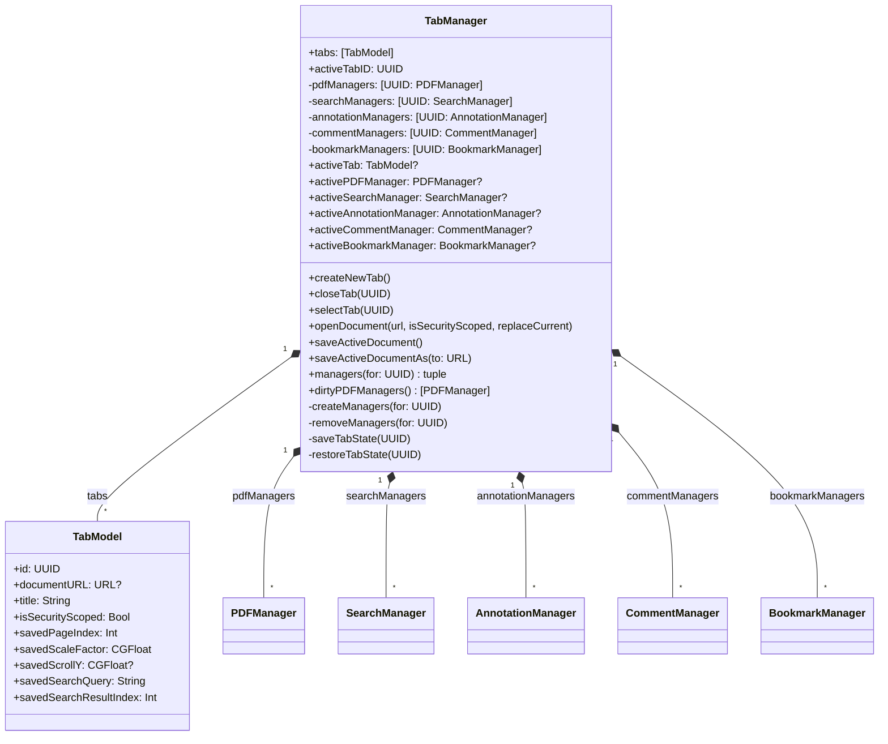
```mermaid
classDiagram
    class TabManager {
        +tabs: [TabModel]
        +activeTabID: UUID
        -pdfManagers: [UUID: PDFManager]
        -searchManagers: [UUID: SearchManager]
        -annotationManagers: [UUID: AnnotationManager]
        -commentManagers: [UUID: CommentManager]
        -bookmarkManagers: [UUID: BookmarkManager]
        +activeTab: TabModel?
        +activePDFManager: PDFManager?
        +activeSearchManager: SearchManager?
        +activeAnnotationManager: AnnotationManager?
        +activeCommentManager: CommentManager?
        +activeBookmarkManager: BookmarkManager?
        +createNewTab()
        +closeTab(UUID)
        +selectTab(UUID)
        +openDocument(url, isSecurityScoped, replaceCurrent)
        +saveActiveDocument()
        +saveActiveDocumentAs(to: URL)
        +managers(for: UUID) tuple
        +dirtyPDFManagers() [PDFManager]
        -createManagers(for: UUID)
        -removeManagers(for: UUID)
        -saveTabState(UUID)
        -restoreTabState(UUID)
    }

    class TabModel {
        +id: UUID
        +documentURL: URL?
        +title: String
        +isSecurityScoped: Bool
        +savedPageIndex: Int
        +savedScaleFactor: CGFloat
        +savedScrollY: CGFloat?
        +savedSearchQuery: String
        +savedSearchResultIndex: Int
    }

    TabManager "1" *-- "*" TabModel : tabs
    TabManager "1" *-- "*" PDFManager : pdfManagers
    TabManager "1" *-- "*" SearchManager : searchManagers
    TabManager "1" *-- "*" AnnotationManager : annotationManagers
    TabManager "1" *-- "*" CommentManager : commentManagers
    TabManager "1" *-- "*" BookmarkManager : bookmarkManagers
```

### Properties

| Property | Type | Purpose |
|----------|------|---------|
| `tabs` | `[TabModel]` | Array of tab metadata |
| `activeTabID` | `UUID` | Currently active tab |
| `pdfManagers` | `[UUID: PDFManager]` | Per-tab PDF managers |
| `searchManagers` | `[UUID: SearchManager]` | Per-tab search managers |
| `annotationManagers` | `[UUID: AnnotationManager]` | Per-tab annotation managers |
| `commentManagers` | `[UUID: CommentManager]` | Per-tab comment managers |
| `bookmarkManagers` | `[UUID: BookmarkManager]` | Per-tab bookmark managers |

### Computed Properties

```
activeTab → tabs.first { $0.id == activeTabID }
activePDFManager → pdfManagers[activeTabID]
activeSearchManager → searchManagers[activeTabID]
activeAnnotationManager → annotationManagers[activeTabID]
activeCommentManager → commentManagers[activeTabID]
activeBookmarkManager → bookmarkManagers[activeTabID]
```

### managers(for:) Method

Returns tuple of all managers for a tab:
```
(PDFManager, SearchManager, AnnotationManager, CommentManager, BookmarkManager)
```

Used by `MainView` to get all managers in one call.

---

## Tab Lifecycle

### Creating a Tab

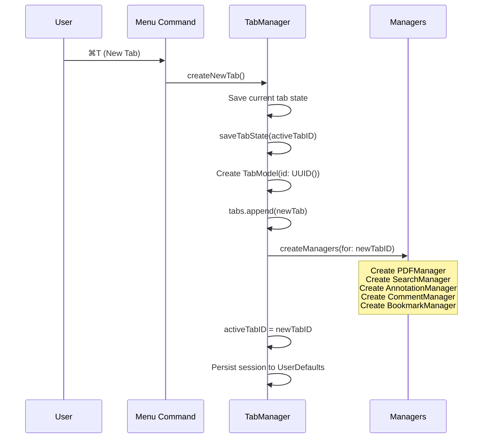
```mermaid
sequenceDiagram
    participant User
    participant Menu as Menu Command
    participant TM as TabManager
    participant Managers

    User->>Menu: ⌘T (New Tab)
    Menu->>TM: createNewTab()

    TM->>TM: Save current tab state
    TM->>TM: saveTabState(activeTabID)

    TM->>TM: Create TabModel(id: UUID())
    TM->>TM: tabs.append(newTab)

    TM->>Managers: createManagers(for: newTabID)
    Note over Managers: Create PDFManager<br/>Create SearchManager<br/>Create AnnotationManager<br/>Create CommentManager<br/>Create BookmarkManager

    TM->>TM: activeTabID = newTabID
    TM->>TM: Persist session to UserDefaults
```

### createManagers(for:) Method

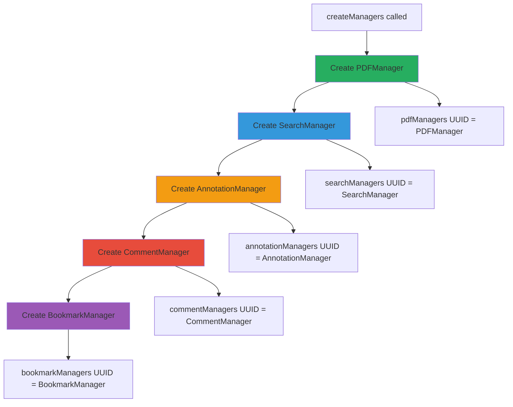
```mermaid
flowchart TD
    A[createManagers called] --> B[Create PDFManager]
    B --> C[Create SearchManager]
    C --> D[Create AnnotationManager]
    D --> E[Create CommentManager]
    E --> F[Create BookmarkManager]

    B --> B1[pdfManagers UUID = PDFManager]
    C --> C1[searchManagers UUID = SearchManager]
    D --> D1[annotationManagers UUID = AnnotationManager]
    E --> E1[commentManagers UUID = CommentManager]
    F --> F1[bookmarkManagers UUID = BookmarkManager]

    style B fill:#27ae60
    style C fill:#3498db
    style D fill:#f39c12
    style E fill:#e74c3c
    style F fill:#9b59b6
```

### Closing a Tab

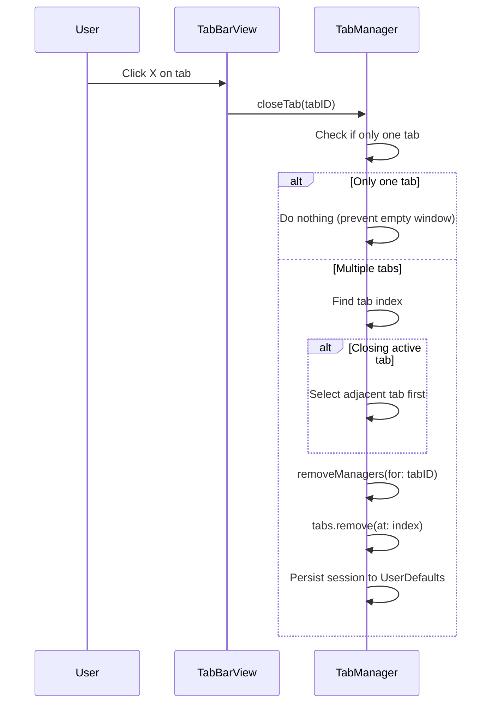
```mermaid
sequenceDiagram
    participant User
    participant TBV as TabBarView
    participant TM as TabManager

    User->>TBV: Click X on tab
    TBV->>TM: closeTab(tabID)

    TM->>TM: Check if only one tab
    alt Only one tab
        TM->>TM: Do nothing (prevent empty window)
    else Multiple tabs
        TM->>TM: Find tab index

        alt Closing active tab
            TM->>TM: Select adjacent tab first
        end

        TM->>TM: removeManagers(for: tabID)
        TM->>TM: tabs.remove(at: index)
        TM->>TM: Persist session to UserDefaults
    end
```

### removeManagers(for:) Cleanup

```
pdfManagers.removeValue(forKey: tabID)
searchManagers.removeValue(forKey: tabID)
annotationManagers.removeValue(forKey: tabID)
commentManagers.removeValue(forKey: tabID)
bookmarkManagers.removeValue(forKey: tabID)
```

### Switching Tabs

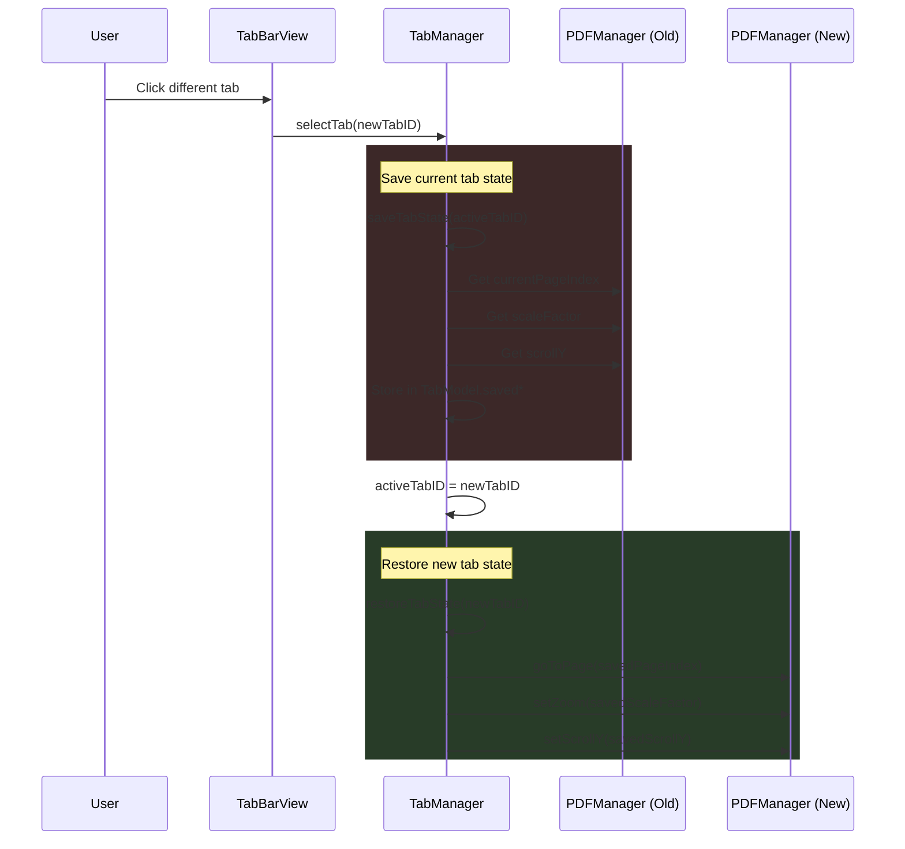
```mermaid
sequenceDiagram
    participant User
    participant TBV as TabBarView
    participant TM as TabManager
    participant PM_Old as PDFManager (Old)
    participant PM_New as PDFManager (New)

    User->>TBV: Click different tab
    TBV->>TM: selectTab(newTabID)

    rect rgb(60, 40, 40)
        Note over TM: Save current tab state
        TM->>TM: saveTabState(activeTabID)
        TM->>PM_Old: Get currentPageIndex
        TM->>PM_Old: Get scaleFactor
        TM->>PM_Old: Get scrollY
        TM->>TM: Store in TabModel.saved*
    end

    TM->>TM: activeTabID = newTabID

    rect rgb(40, 60, 40)
        Note over TM: Restore new tab state
        TM->>TM: restoreTabState(newTabID)
        TM->>PM_New: goToPage(savedPageIndex)
        TM->>PM_New: setZoom(savedScaleFactor)
        TM->>PM_New: setScrollY(savedScrollY)
    end
```

### State Preservation

**Saved state per tab:**

| Field | Source | Purpose |
|-------|--------|---------|
| `savedPageIndex` | PDFManager.currentPageIndex | Restore page position |
| `savedScaleFactor` | PDFManager.scaleFactor | Restore zoom level |
| `savedScrollY` | PDFView scroll position | Restore scroll offset |
| `savedSearchQuery` | SearchManager.searchQuery | Restore search |
| `savedSearchResultIndex` | SearchManager.currentResultIndex | Restore search position |

---

## TabModel Data Structure

**File:** `Models/TabModel.swift`

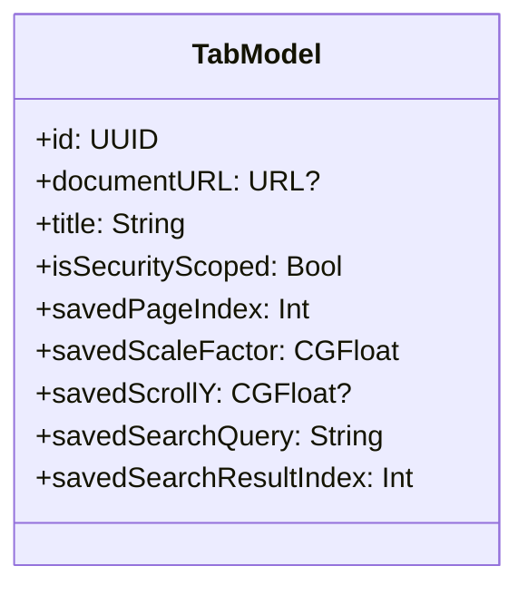
```mermaid
classDiagram
    class TabModel {
        +id: UUID
        +documentURL: URL?
        +title: String
        +isSecurityScoped: Bool
        +savedPageIndex: Int
        +savedScaleFactor: CGFloat
        +savedScrollY: CGFloat?
        +savedSearchQuery: String
        +savedSearchResultIndex: Int
    }
```

### Properties

| Property | Type | Default | Purpose |
|----------|------|---------|---------|
| `id` | `UUID` | Auto-generated | Unique identifier |
| `documentURL` | `URL?` | nil | Path to PDF file |
| `title` | `String` | "New Tab" | Tab display name |
| `isSecurityScoped` | `Bool` | false | Whether URL needs security scope |
| `savedPageIndex` | `Int` | 0 | Persisted page position |
| `savedScaleFactor` | `CGFloat` | 1.0 | Persisted zoom level |
| `savedScrollY` | `CGFloat?` | nil | Persisted scroll offset |
| `savedSearchQuery` | `String` | "" | Persisted search query |
| `savedSearchResultIndex` | `Int` | 0 | Persisted search position |

### Codable Conformance

TabModel conforms to `Codable` for UserDefaults persistence.

---

## Opening Documents

### openDocument Flow

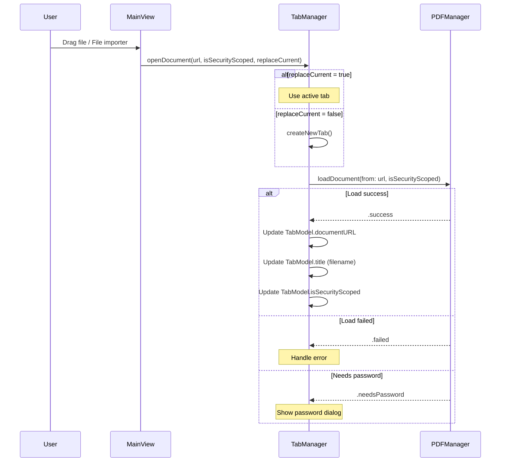
```mermaid
sequenceDiagram
    participant User
    participant MV as MainView
    participant TM as TabManager
    participant PM as PDFManager

    User->>MV: Drag file / File importer
    MV->>TM: openDocument(url, isSecurityScoped, replaceCurrent)

    alt replaceCurrent = true
        Note over TM: Use active tab
    else replaceCurrent = false
        TM->>TM: createNewTab()
    end

    TM->>PM: loadDocument(from: url, isSecurityScoped)

    alt Load success
        PM-->>TM: .success
        TM->>TM: Update TabModel.documentURL
        TM->>TM: Update TabModel.title (filename)
        TM->>TM: Update TabModel.isSecurityScoped
    else Load failed
        PM-->>TM: .failed
        Note over TM: Handle error
    else Needs password
        PM-->>TM: .needsPassword
        Note over TM: Show password dialog
    end
```

### Opening Multiple Files

When user drags multiple files:
1. First file opens in current tab (if empty) or new tab
2. Remaining files each open in new tabs
3. Last opened file becomes active

---

## WindowRegistry

**File:** `Managers/WindowRegistry.swift`
**Type:** Thread-safe singleton

### Purpose

Tracks all TabManagers across all windows for:
- App-wide dirty document detection
- Quit confirmation prompts
- Global operations

### Class Diagram

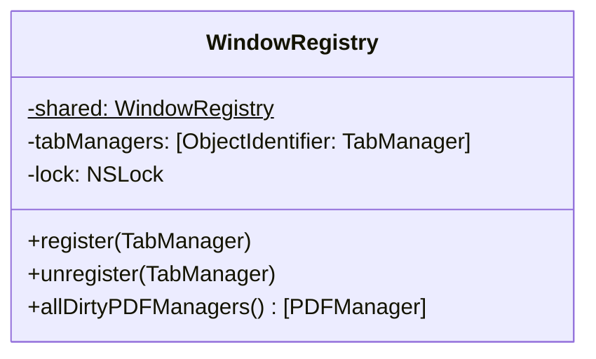
```mermaid
classDiagram
    class WindowRegistry {
        -shared: WindowRegistry$
        -tabManagers: [ObjectIdentifier: TabManager]
        -lock: NSLock
        +register(TabManager)
        +unregister(TabManager)
        +allDirtyPDFManagers() [PDFManager]
    }
```

### Registration Flow

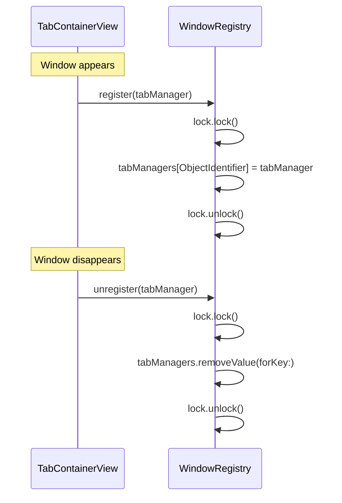
```mermaid
sequenceDiagram
    participant TCV as TabContainerView
    participant WR as WindowRegistry

    Note over TCV: Window appears
    TCV->>WR: register(tabManager)
    WR->>WR: lock.lock()
    WR->>WR: tabManagers[ObjectIdentifier] = tabManager
    WR->>WR: lock.unlock()

    Note over TCV: Window disappears
    TCV->>WR: unregister(tabManager)
    WR->>WR: lock.lock()
    WR->>WR: tabManagers.removeValue(forKey:)
    WR->>WR: lock.unlock()
```

### allDirtyPDFManagers()

Used by AppDelegate for quit confirmation:

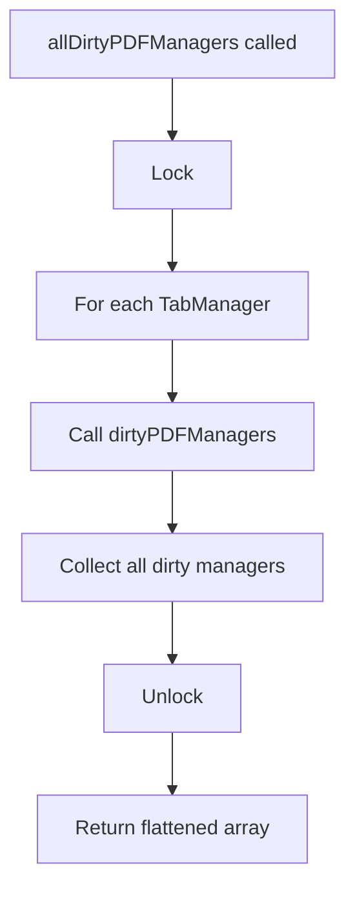
```mermaid
flowchart TD
    A[allDirtyPDFManagers called] --> B[Lock]
    B --> C[For each TabManager]
    C --> D[Call dirtyPDFManagers]
    D --> E[Collect all dirty managers]
    E --> F[Unlock]
    F --> G[Return flattened array]
```

---

## TabContainerView

**File:** `Views/TabContainerView.swift`
**Type:** SwiftUI View (per-window root)

### Structure

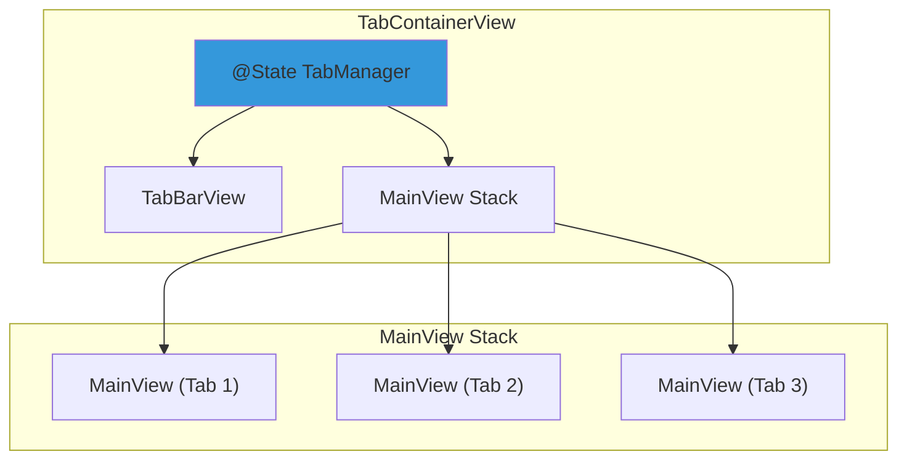
```mermaid
graph TD
    subgraph TabContainerView
        TM["@State TabManager"]
        TBV[TabBarView]
        MVS[MainView Stack]
    end

    subgraph "MainView Stack"
        MV1["MainView (Tab 1)"]
        MV2["MainView (Tab 2)"]
        MV3["MainView (Tab 3)"]
    end

    TM --> TBV
    TM --> MVS
    MVS --> MV1
    MVS --> MV2
    MVS --> MV3

    style TM fill:#3498db
```

### Tab Visibility

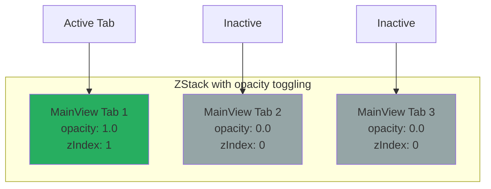
```mermaid
flowchart TD
    subgraph "ZStack with opacity toggling"
        MV1["MainView Tab 1<br/>opacity: 1.0<br/>zIndex: 1"]
        MV2["MainView Tab 2<br/>opacity: 0.0<br/>zIndex: 0"]
        MV3["MainView Tab 3<br/>opacity: 0.0<br/>zIndex: 0"]
    end

    Active[Active Tab] --> MV1
    Inactive1[Inactive] --> MV2
    Inactive2[Inactive] --> MV3

    style MV1 fill:#27ae60
    style MV2 fill:#95a5a6
    style MV3 fill:#95a5a6
```

**Why opacity toggling?**
- Keeps all tab views in memory
- Instant tab switching (no view recreation)
- Preserves PDFView scroll position and state

### Lifecycle

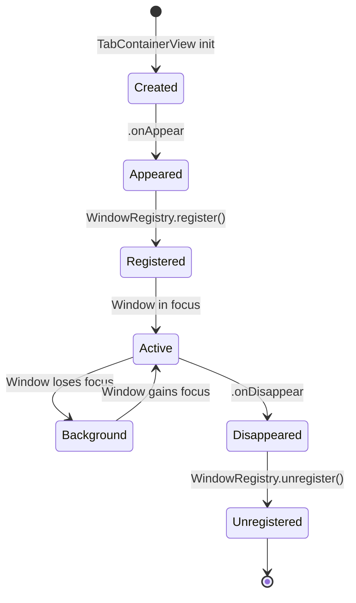
```mermaid
stateDiagram-v2
    [*] --> Created: TabContainerView init

    Created --> Appeared: .onAppear
    Appeared --> Registered: WindowRegistry.register()

    Registered --> Active: Window in focus
    Active --> Background: Window loses focus
    Background --> Active: Window gains focus

    Active --> Disappeared: .onDisappear
    Disappeared --> Unregistered: WindowRegistry.unregister()
    Unregistered --> [*]
```

### FocusedValues Setup

TabContainerView sets FocusedValues for menu access:

```
.focusedSceneValue(\.focusedTabManager, tabManager)
.focusedSceneValue(\.focusedShowingSearch, $showingSearch)
.focusedSceneValue(\.focusedShowingOutline, $showingOutline)
.focusedSceneValue(\.focusedShowingComments, $showingComments)
.focusedSceneValue(\.focusedShowingGoToPage, $showingGoToPage)
.focusedSceneValue(\.focusedShowingFileImporter, $showingFileImporter)
```

---

## TabBarView

**File:** `Views/TabBarView.swift`
**Type:** SwiftUI View

### Layout


```mermaid
graph LR
    subgraph TabBarView
        DragArea[WindowDragArea]
        Tabs[HStack of TabItemViews]
        NewBtn[New Tab Button]
    end

    DragArea --> Tabs
    Tabs --> NewBtn

    subgraph TabItemView
        Icon[Document Icon]
        Title[Tab Title]
        Close[Close Button]
    end

    Tabs --> TabItemView

    style TabBarView fill:#2c3e50
```

### Tab Drag & Drop Reordering

**Implementation:** `TabBarView.swift` uses `DragGesture` with `highPriorityGesture` modifier to ensure tab drags take precedence over parent hover tracking.

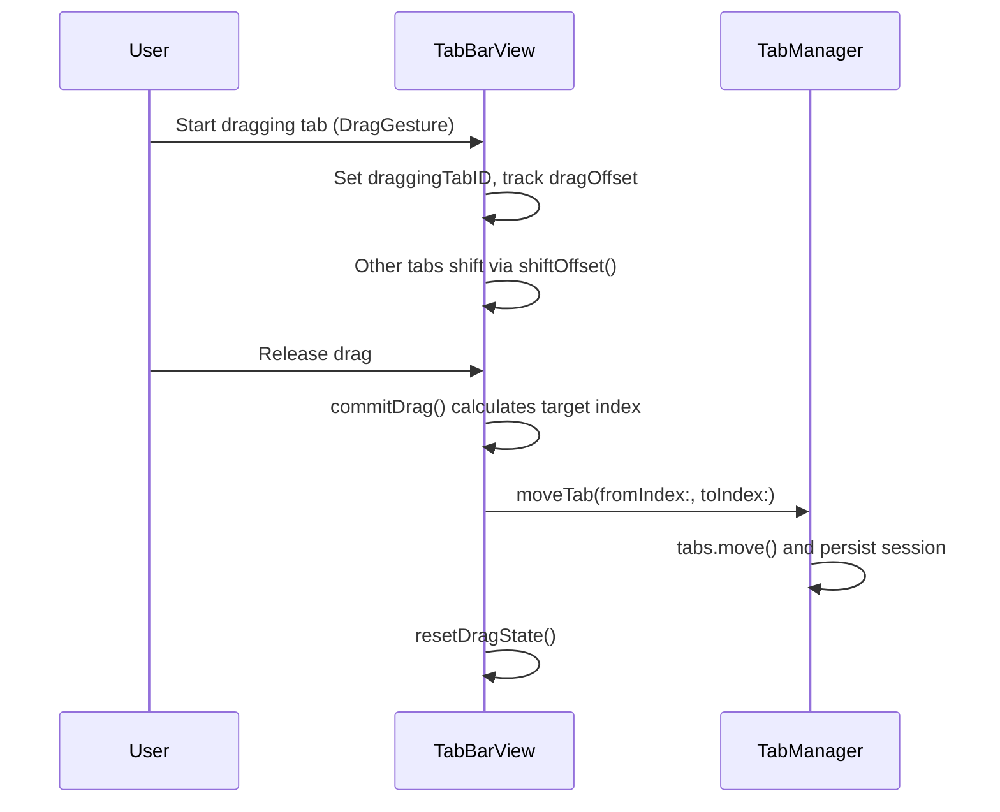
```mermaid
sequenceDiagram
    participant User
    participant TBV as TabBarView
    participant TM as TabManager

    User->>TBV: Start dragging tab (DragGesture)
    TBV->>TBV: Set draggingTabID, track dragOffset
    TBV->>TBV: Other tabs shift via shiftOffset()

    User->>TBV: Release drag
    TBV->>TBV: commitDrag() calculates target index
    TBV->>TM: moveTab(fromIndex:, toIndex:)
    TM->>TM: tabs.move() and persist session
    TBV->>TBV: resetDragState()
```

**Key Design Decisions:**
- `highPriorityGesture` ensures drag takes precedence over parent hit areas
- Each tab tracks its frame via `PreferenceKey` for position-based reordering
- Visual feedback: dragged tab scales up (1.02x), other tabs shift to make room
- Animation: smooth 0.15s transitions for drag state changes

### Visual States

| State | Appearance |
|-------|------------|
| Active | Highlighted background, bold title |
| Inactive | Subdued background |
| Hover | Close button visible |
| Dirty | Dot indicator (unsaved changes) |

---

## AppDelegate & Quit Handling

**File:** `AppDelegate.swift`

### Quit Flow

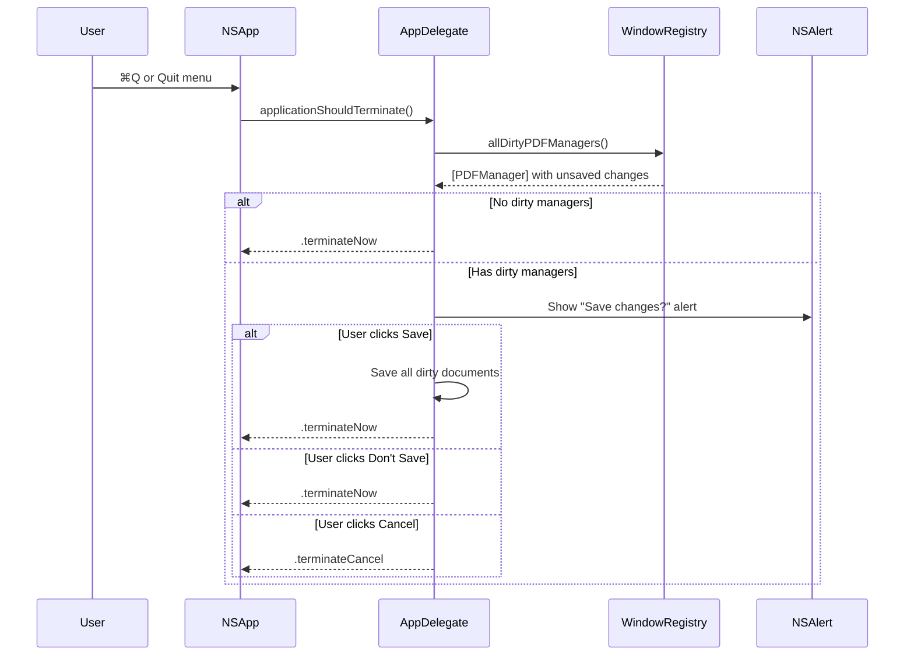
```mermaid
sequenceDiagram
    participant User
    participant NSApp
    participant AD as AppDelegate
    participant WR as WindowRegistry
    participant Alert as NSAlert

    User->>NSApp: ⌘Q or Quit menu
    NSApp->>AD: applicationShouldTerminate()

    AD->>WR: allDirtyPDFManagers()
    WR-->>AD: [PDFManager] with unsaved changes

    alt No dirty managers
        AD-->>NSApp: .terminateNow
    else Has dirty managers
        AD->>Alert: Show "Save changes?" alert

        alt User clicks Save
            AD->>AD: Save all dirty documents
            AD-->>NSApp: .terminateNow
        else User clicks Don't Save
            AD-->>NSApp: .terminateNow
        else User clicks Cancel
            AD-->>NSApp: .terminateCancel
        end
    end
```

### applicationShouldTerminate Implementation

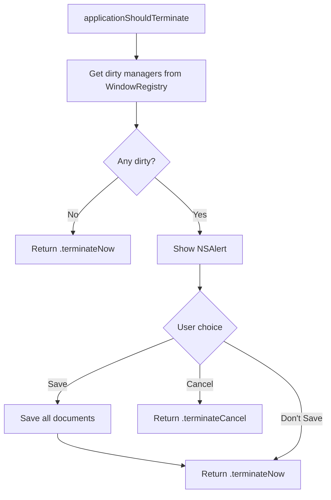
```mermaid
flowchart TD
    A[applicationShouldTerminate] --> B[Get dirty managers from WindowRegistry]
    B --> C{Any dirty?}
    C -->|No| D[Return .terminateNow]
    C -->|Yes| E[Show NSAlert]

    E --> F{User choice}
    F -->|Save| G[Save all documents]
    G --> H[Return .terminateNow]
    F -->|Don't Save| H
    F -->|Cancel| I[Return .terminateCancel]
```

---

## Menu Commands & FocusedValues

### FocusedValues System

**File:** `Config/FocusedValues.swift`

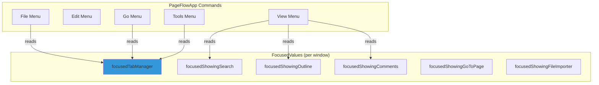
```mermaid
graph TD
    subgraph "FocusedValues (per window)"
        FTM[focusedTabManager]
        FSS[focusedShowingSearch]
        FSO[focusedShowingOutline]
        FSC[focusedShowingComments]
        FGP[focusedShowingGoToPage]
        FFI[focusedShowingFileImporter]
    end

    subgraph "PageFlowApp Commands"
        FileMenu[File Menu]
        EditMenu[Edit Menu]
        ViewMenu[View Menu]
        GoMenu[Go Menu]
        ToolsMenu[Tools Menu]
    end

    FileMenu -->|reads| FTM
    ViewMenu -->|reads| FSS
    ViewMenu -->|reads| FSO
    ViewMenu -->|reads| FSC
    GoMenu -->|reads| FTM
    ToolsMenu -->|reads| FTM

    style FTM fill:#3498db
```

### FocusedValue Keys

| Key | Type | Purpose |
|-----|------|---------|
| `focusedTabManager` | `TabManager?` | Access to current window's TabManager |
| `focusedShowingSearch` | `Binding<Bool>?` | Toggle search bar visibility |
| `focusedShowingOutline` | `Binding<Bool>?` | Toggle sidebar visibility |
| `focusedShowingComments` | `Binding<Bool>?` | Toggle comments sidebar |
| `focusedShowingGoToPage` | `Binding<Bool>?` | Show go-to-page dialog |
| `focusedShowingFileImporter` | `Binding<Bool>?` | Show file importer |

### Menu Command Flow

```mermaid
sequenceDiagram
    participant User
    participant Menu as Menu Command
    participant FV as FocusedValues
    participant TM as TabManager
    participant PM as PDFManager

    User->>Menu: ⌘S (Save)
    Menu->>FV: @FocusedValue(\.focusedTabManager)
    FV-->>Menu: TabManager? for focused window

    alt TabManager exists
        Menu->>TM: saveActiveDocument()
        TM->>PM: save()
    else No focused window
        Note over Menu: Command disabled
    end
```

### Command Enabling/Disabling

Commands check state before enabling:

```
.disabled(tabManager?.activePDFManager?.hasDocument != true)
```

---

## Session Persistence

### UserDefaults Storage

TabManager persists session to UserDefaults:

```mermaid
graph LR
    subgraph "Runtime"
        TM[TabManager]
        Tabs[tabs array]
        Active[activeTabID]
    end

    subgraph "UserDefaults"
        KEY["tabSession"]
        VALUE[Encoded session data]
    end

    TM --> Tabs
    TM --> Active
    Tabs -->|JSONEncoder| VALUE
    Active -->|JSONEncoder| VALUE
    VALUE --> KEY

    style KEY fill:#636e72
```

### Session Structure

```
{
    "tabs": [TabModel],
    "activeTabID": UUID
}
```

### Restoration Flow

```mermaid
sequenceDiagram
    participant TCV as TabContainerView
    participant TM as TabManager
    participant UD as UserDefaults

    TCV->>TM: init()
    TM->>UD: Load session data
    UD-->>TM: Encoded session or nil

    alt Session exists
        TM->>TM: Decode [TabModel]
        TM->>TM: Set activeTabID
        TM->>TM: Create managers for each tab
        Note over TM: Restore documents asynchronously
    else No session
        TM->>TM: Create single empty tab
    end
```

---

## Complete Data Flow

### New Window Creation

```
NSApp.newWindow or ⌘N
    → WindowGroup creates TabContainerView
    → TabContainerView creates @State TabManager
    → TabManager creates initial tab + managers
    → TabContainerView.onAppear
    → WindowRegistry.register(tabManager)
    → FocusedValues set for menus
```

### Document Opening from Finder

```
User double-clicks PDF (PageFlow is default)
    → NSApp receives open URL event
    → TabContainerView.onOpenURL
    → tabManager.openDocument(url, isSecurityScoped: true)
    → PDFManager.loadDocument()
    → TabModel updated with URL, title
    → MainView displays PDF
```

### Tab Switch

```
User clicks tab in TabBarView
    → TabBarView.tabButton.action
    → tabManager.selectTab(tabID)
    → Save current tab state (page, zoom, scroll)
    → activeTabID = newTabID
    → Restore new tab state
    → MainView opacity changes (old=0, new=1)
    → PDFViewWrapper.updateNSView syncs document
```

### Window Close

```
User clicks window close or ⌘W
    → TabContainerView.onDisappear
    → WindowRegistry.unregister(tabManager)
    → TabManager deallocated
    → All per-tab managers deallocated
```

---

## Key Patterns

### Per-Tab Manager Isolation

Each tab has completely independent managers:
- No shared state between tabs
- Tab switch = manager switch
- Closing tab = manager cleanup

### Opacity-Based Tab Switching

```
ForEach(tabManager.tabs) { tab in
    MainView(...)
        .opacity(tab.id == tabManager.activeTabID ? 1 : 0)
        .zIndex(tab.id == tabManager.activeTabID ? 1 : 0)
}
```

Benefits:
- All views remain in hierarchy
- No view recreation on switch
- Preserves scroll position, selection state

### WindowRegistry Singleton

Thread-safe global tracking:
- Enables app-wide operations (quit check)
- Decoupled from individual windows
- Lock-based thread safety

### FocusedValues for Menus

SwiftUI's focus system:
- Menu commands access focused window's state
- Automatic enable/disable based on context
- Type-safe key-value pairs

---

## Design Tokens

**Tab Bar:**
- `tabBarHeight`: 28pt
- `tabHeight`: 26pt
- `tabMaxWidth`: 180pt
- `tabCornerRadius`: 6pt
- `tabSpacing`: 2pt
- `tabCloseButtonSize`: 14pt
- `newTabButtonSize`: 20pt

**Colors:**
- Active tab: Higher opacity background
- Inactive tab: Lower opacity background
- Close button: Visible on hover
- Dirty indicator: Accent color dot
