# PageFlow System Architecture

A comprehensive architecture reference for AI coding agents working with this macOS PDF viewer.

---

## Overview

**PageFlow** is a native macOS PDF viewer built with SwiftUI + PDFKit. Target: macOS 12+.

**Tech Stack:**
- SwiftUI (UI layer)
- PDFKit (PDF rendering via NSViewRepresentable)
- @Observable pattern (state management)
- @MainActor (thread safety)

**Core Principles:**
- Pure SwiftUI with AppKit bridging only for PDFKit
- Multi-window, multi-tab architecture
- Security-scoped resource management for sandboxed file access
- Undo/redo support via NSUndoManager

---

## Component Hierarchy

```mermaid
graph TD
    subgraph App["PageFlowApp (@main)"]
        AD[AppDelegate]
        WR[WindowRegistry.shared]
        MC[Menu Commands]
    end

    subgraph Window["WindowGroup (per window)"]
        TCV[TabContainerView]
        TM["@State TabManager"]

        subgraph Managers["Per-Tab Managers"]
            PM[PDFManager]
            SM[SearchManager]
            AM[AnnotationManager]
            CM[CommentManager]
            BM[BookmarkManager]
        end

        subgraph Views["MainView (per tab)"]
            PVW[PDFViewWrapper]
            SPV[StablePDFView]
            SV[SidebarView]
            CS[CommentsSidebar]
            FT[FloatingToolbar]
            TB[TabBarView]
            SB[SearchBar]
        end
    end

    App --> Window
    AD --> WR
    TCV --> TM
    TM --> Managers
    TM --> Views
    PVW --> SPV
    MC -.->|FocusedValues| TM

    style App fill:#1a1a2e
    style Window fill:#16213e
    style Managers fill:#0f3460
    style Views fill:#533483
```

---

## Manager Architecture

### Manager Dependency Graph

```mermaid
graph LR
    subgraph Singletons["Global Singletons"]
        WR[WindowRegistry.shared]
        SET[SettingsManager.shared]
    end

    subgraph TabManager["TabManager (owns per-tab)"]
        direction TB
        PM[PDFManager]
        SM[SearchManager]
        AM[AnnotationManager]
        CM[CommentManager]
        BM[BookmarkManager]
    end

    subgraph AppLevel["App-Level Managers"]
        RFM[RecentFilesManager]
        FLM[FirstLaunchManager]
        UM[UpdateManager]
    end

    WR -->|tracks| TabManager
    SM -->|reads document| PM
    AM -->|weak ref| PM
    CM -->|weak ref| PM
    BM -->|weak ref| PM

    AM -.->|color presets| SET
    AM -.->|selectionProvider| PVW[PDFViewWrapper]
    CM -.->|selectionProvider| PVW

    style Singletons fill:#2c3e50
    style TabManager fill:#2d3436
    style AppLevel fill:#1a1a2e
    style PM fill:#0984e3
    style SM fill:#00b894
    style AM fill:#fdcb6e
    style CM fill:#e17055
    style BM fill:#6c5ce7
```

### Manager Class Diagram

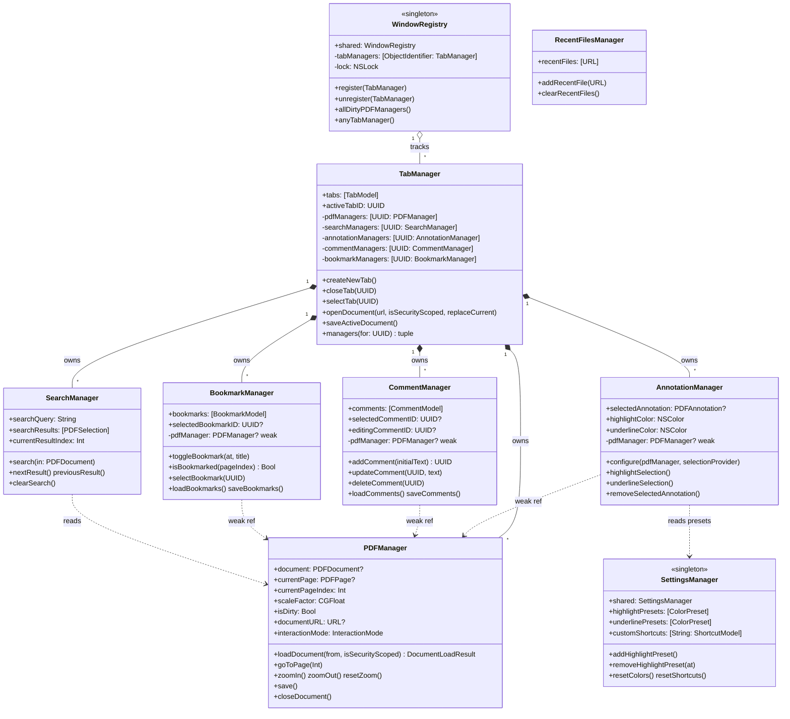

---

## View Hierarchy

```mermaid
graph TD
    subgraph PageFlowApp
        WG[WindowGroup]
        SW[Settings Window]
    end

    subgraph TabContainerView
        WR[WindowRegistrar]
        TBV[TabBarView]
        MV[MainView x N stacked]
    end

    subgraph TabBarView
        TIV[TabItemView x N]
        TBGV[TabBarGestureView]
    end

    subgraph MainView
        direction TB
        ES[EmptyState]
        PVW[PDFViewWrapper]
        SV[SidebarView]
        CS[CommentsSidebar]
        FT[FloatingToolbar]
        SB[SearchBar]
        TL[TrafficLightsView]
        WDA[WindowDragArea]
        WC[WindowConfigurator]
    end

    subgraph PDFViewWrapper
        SPV[StablePDFView]
        GS[GlassScroller]
        COORD[Coordinator]
    end

    subgraph SidebarView
        OL[Outline Mode]
        TGV[ThumbnailGridView]
        BK[Bookmarks Mode]
    end

    subgraph ThumbnailGridView
        TC[ThumbnailCell x N]
    end

    subgraph SettingsWindow["Settings Window"]
        STV[SettingsView]
        GST[GeneralSettingsTab]
        SST[ShortcutsSettingsTab]
        CWV[ColorWellView]
    end

    WG --> TabContainerView
    SW --> SettingsWindow
    TabContainerView --> WR
    TabContainerView --> TBV
    TabContainerView --> MV
    TBV --> TIV
    TBV --> TBGV
    MV --> ES
    MV --> PVW
    MV --> SV
    MV --> CS
    MV --> FT
    MV --> SB
    MV --> TL
    MV --> WDA
    MV --> WC
    PVW --> SPV
    PVW --> GS
    PVW --> COORD
    SV --> OL
    SV --> TGV
    SV --> BK
    TGV --> TC
    STV --> GST
    STV --> SST
    GST --> CWV

    style PageFlowApp fill:#1e3a5f
    style TabContainerView fill:#2e5077
    style TabBarView fill:#3a506b
    style MainView fill:#4da1a9
    style PDFViewWrapper fill:#79d7be
    style SidebarView fill:#ffc857
    style ThumbnailGridView fill:#e8a838
    style SettingsWindow fill:#5c4d7d
```

---

## Data Models

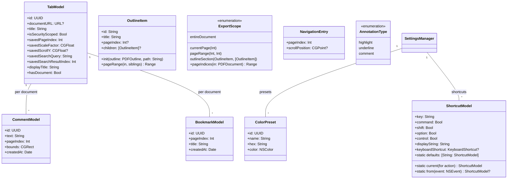

---

## State Flow Diagrams

### Opening a PDF

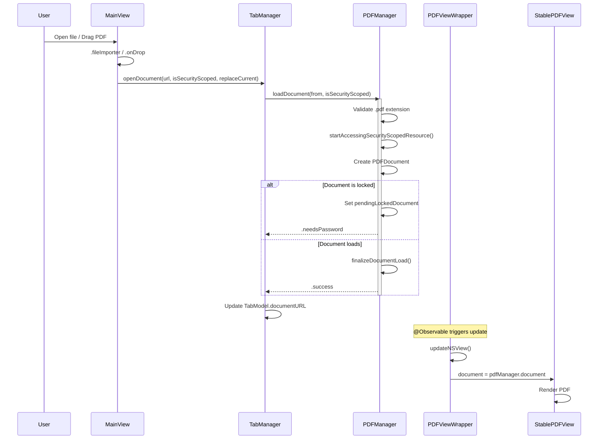

### Creating an Annotation

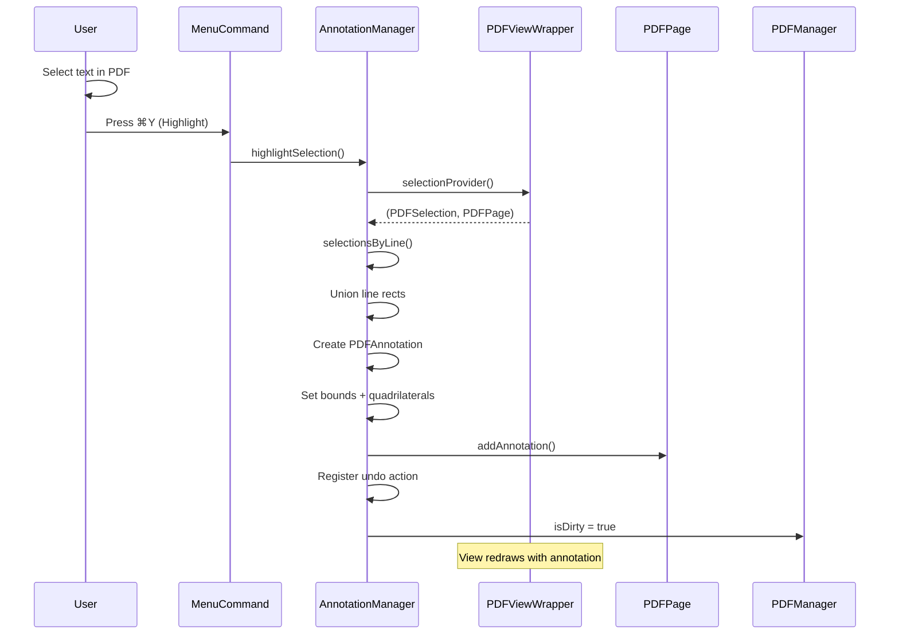

### Saving Document

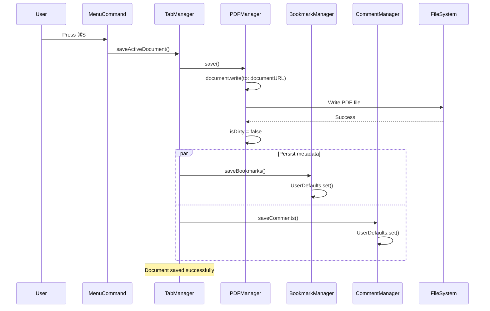

### Tab Switching Flow

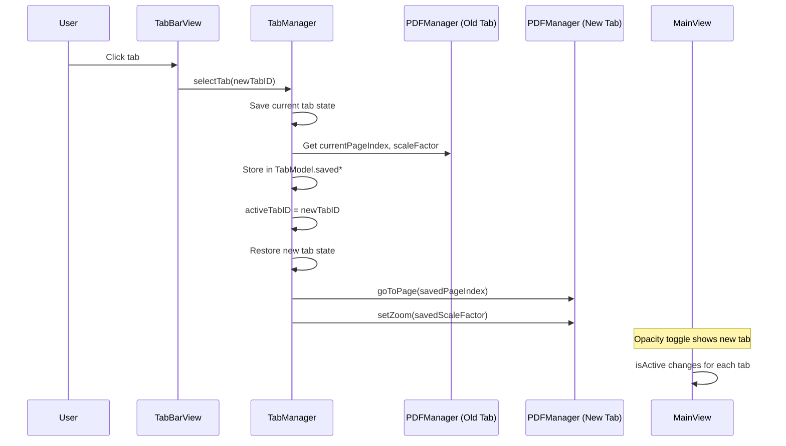

### Keyboard Shortcut Resolution Flow

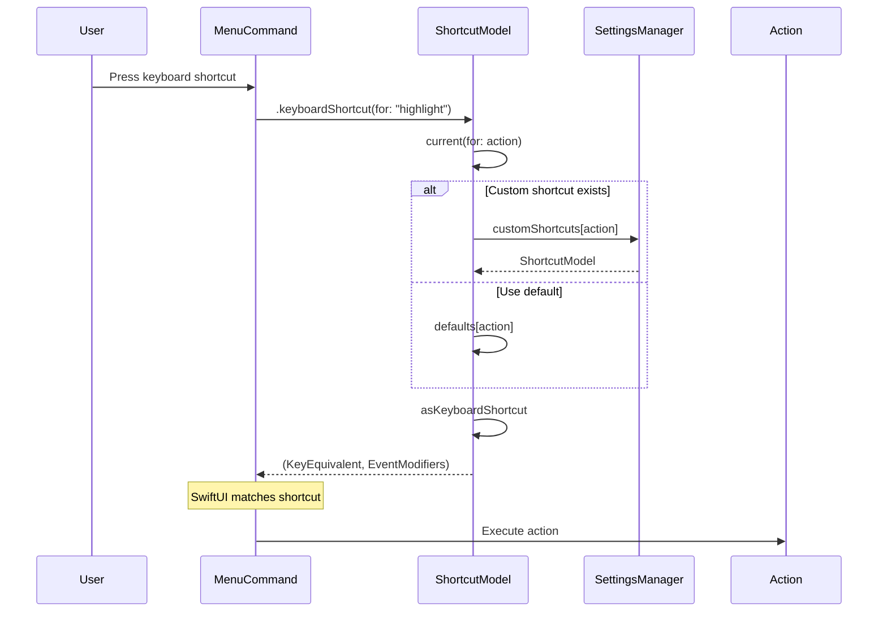

### Markdown Export Flow

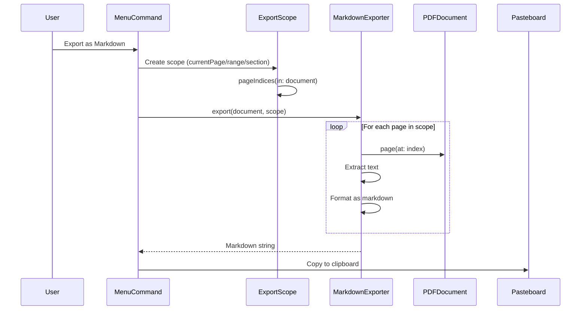

---

## Document Lifecycle State Machine

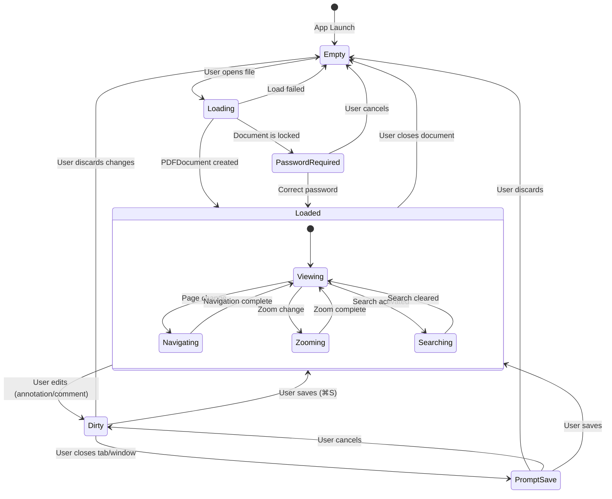

---

## Window & Tab Architecture

```mermaid
graph TD
    subgraph Global
        WR[WindowRegistry.shared]
        AD[AppDelegate]
    end

    subgraph Window1["Window 1"]
        TM1[TabManager 1]
        subgraph Tabs1["Tabs"]
            T1A[Tab A - doc1.pdf]
            T1B[Tab B - doc2.pdf]
        end
    end

    subgraph Window2["Window 2"]
        TM2[TabManager 2]
        subgraph Tabs2["Tabs"]
            T2A[Tab C - doc3.pdf]
        end
    end

    WR -->|tracks| TM1
    WR -->|tracks| TM2
    AD -->|quit check| WR
    TM1 --> Tabs1
    TM2 --> Tabs2

    style Global fill:#2c3e50
    style Window1 fill:#34495e
    style Window2 fill:#34495e
```

---

## File Organization

```
PageFlow/
├── PageFlowApp.swift              App entry point, menu commands (507 lines)
├── AppDelegate.swift              App lifecycle, quit prompts, Finder open
│
├── Config/
│   ├── DesignTokens.swift         Colors, spacing, layout constants (128+ tokens)
│   └── FocusedValues.swift        Per-window state keys for menus (7 keys)
│
├── Models/
│   ├── AnnotationType.swift       Enum: highlight, underline, comment
│   ├── TabModel.swift             Tab data (URL, title, saved state)
│   ├── CommentModel.swift         Comment data (text, bounds, page)
│   ├── BookmarkModel.swift        Bookmark data (pageIndex, title)
│   ├── OutlineItem.swift          PDF TOC structure (recursive)
│   ├── ShortcutModel.swift        Keyboard shortcut with modifiers
│   ├── ExportScope.swift          Markdown export scope (page/range/section)
│   └── NavigationEntry.swift      Back/forward history entry
│
├── Managers/
│   ├── PDFManager.swift           Core PDF operations (@Observable)
│   ├── TabManager.swift           Multi-tab state management (@Observable)
│   ├── SearchManager.swift        Text search + navigation (@Observable @MainActor)
│   ├── AnnotationManager.swift    Highlight/underline creation (@Observable @MainActor)
│   ├── CommentManager.swift       Comment CRUD operations (@Observable @MainActor)
│   ├── BookmarkManager.swift      Page bookmarks (@Observable @MainActor)
│   ├── SettingsManager.swift      Color presets, keyboard shortcuts (singleton)
│   ├── WindowRegistry.swift       Global window tracking (singleton, thread-safe)
│   ├── RecentFilesManager.swift   Recent files list (@Observable)
│   ├── FirstLaunchManager.swift   Default PDF reader setup (@Observable)
│   ├── UpdateManager.swift        Sparkle updates (conditional compilation)
│   └── SaveNotifications.swift    Notification name definitions
│
├── Utilities/
│   └── MarkdownExporter.swift     PDF to Markdown conversion
│
└── Views/
    ├── TabContainerView.swift     Per-window root, tab stack management
    ├── MainView.swift             Primary content layout (483 lines)
    ├── PDFViewWrapper.swift       NSViewRepresentable → StablePDFView
    ├── StablePDFView.swift        Custom PDFView subclass (AppKit)
    ├── SidebarView.swift          Left sidebar (outline/thumbnails/bookmarks)
    ├── CommentsSidebar.swift      Right sidebar (comments + editor)
    ├── FloatingToolbar.swift      Glassmorphism top toolbar
    ├── TabBarView.swift           Tab bar with drag reorder
    ├── TabBarGestureView.swift    NSViewRepresentable for tab gestures
    ├── TabItemView.swift          Individual tab button
    ├── ThumbnailGridView.swift    Page thumbnail grid
    ├── SearchBar.swift            Search input + results navigation
    ├── TrafficLightsView.swift    Custom window control buttons
    ├── WindowDragArea.swift       Draggable window region (NSView)
    ├── WindowConfigurator.swift   Window chrome configuration
    ├── GlassScroller.swift        Custom scroller (NSScroller subclass)
    ├── PDFThumbnailViewWrapper.swift  NSViewRepresentable → PDFThumbnailView
    ├── GestureInterceptView.swift NSViewRepresentable for gesture handling
    ├── NonDraggableArea.swift     Prevents window dragging in region
    │
    └── Settings/
        ├── SettingsView.swift     Settings window with tabs
        ├── GeneralSettingsTab.swift  Color preset management
        ├── ShortcutsSettingsTab.swift  Keyboard shortcut customization
        └── ColorWellView.swift    NSColorWell with hex input
```

**Statistics:** 48 Swift files, ~8,000 lines of code

---

## Core Managers Reference

### PDFManager
**File:** `Managers/PDFManager.swift`
**Type:** `@Observable class`
**Purpose:** Owns PDFDocument lifecycle, navigation, zoom, save operations

**Key Properties:**
- `document: PDFDocument?` - loaded PDF
- `currentPage: PDFPage?`, `currentPageIndex: Int`
- `scaleFactor: CGFloat`, `isAutoScaling: Bool`
- `displayMode: PDFDisplayMode`
- `interactionMode: InteractionMode` (.select or .pan)
- `isDirty: Bool` - unsaved changes flag
- `documentURL: URL?` - source file path
- `isAccessingSecurityScopedResource: Bool`

**Key Methods:**
- `loadDocument(from:isSecurityScoped:)` → DocumentLoadResult
- `unlockDocument(password:)` - password-protected PDFs
- `goToPage(_:)`, `nextPage()`, `previousPage()`, `goToFirstPage()`, `goToLastPage()`
- `zoomIn()`, `zoomOut()`, `resetZoom()`, `setZoom(_:)`
- `rotateClockwise()`, `rotateCounterClockwise()`
- `outlineItems()` → [OutlineItem]
- `save()`, `closeDocument()`

**Dependencies:** None (root manager)

---

### TabManager
**File:** `Managers/TabManager.swift`
**Type:** `@Observable class`
**Purpose:** Manages multi-tab state, owns per-tab manager instances

**Key Properties:**
- `tabs: [TabModel]`
- `activeTabID: UUID`
- `pdfManagers: [UUID: PDFManager]` (private)
- `searchManagers: [UUID: SearchManager]` (private)
- `annotationManagers: [UUID: AnnotationManager]` (private)
- `commentManagers: [UUID: CommentManager]` (private)
- `bookmarkManagers: [UUID: BookmarkManager]` (private)

**Key Methods:**
- `createNewTab()`, `closeTab(_:)`, `selectTab(_:)`
- `openDocument(url:isSecurityScoped:replaceCurrent:)`
- `saveActiveDocument()`, `saveActiveDocumentAs(to:)`
- `managers(for:)` → tuple of all managers for tab
- `dirtyPDFManagers()` → managers with unsaved changes

**Computed Properties:**
- `activeTab`, `activePDFManager`, `activeSearchManager`, etc.

---

### SearchManager
**File:** `Managers/SearchManager.swift`
**Type:** `@Observable @MainActor class`
**Purpose:** PDF text search with result navigation

**Key Properties:**
- `searchQuery: String`
- `searchResults: [PDFSelection]`
- `currentResultIndex: Int`
- `isSearching: Bool`

**Key Methods:**
- `search(in:)` - executes search via PDFDocument.findString()
- `nextResult()`, `previousResult()` - cyclic navigation
- `clearSearch()`
- `currentSelection()` → PDFSelection?
- `highlightedSelections()` → colors current vs other results

---

### AnnotationManager
**File:** `Managers/AnnotationManager.swift`
**Type:** `@Observable @MainActor class`
**Purpose:** Create/edit highlight and underline annotations

**Key Properties:**
- `selectedAnnotation: PDFAnnotation?`
- `highlightColor: NSColor`, `underlineColor: NSColor`
- `pdfManager: PDFManager?` (weak)
- `selectionProvider: () -> (PDFSelection?, PDFPage?)?`

**Key Methods:**
- `configure(pdfManager:selectionProvider:)` - called by PDFViewWrapper
- `highlightSelection()`, `underlineSelection()`
- `addMarkup(type:)` - creates annotation with undo
- `removeSelectedAnnotation()`

---

### CommentManager
**File:** `Managers/CommentManager.swift`
**Type:** `@Observable @MainActor class`
**Purpose:** Create/edit/delete text comments

**Key Properties:**
- `comments: [CommentModel]`
- `selectedCommentID: UUID?`, `editingCommentID: UUID?`
- `highlights: [UUID: PDFAnnotation]` - visual anchors
- `pdfManager: PDFManager?` (weak)
- `selectionProvider: () -> (PDFSelection?, PDFPage?)?`

**Key Methods:**
- `configure(pdfManager:selectionProvider:)`
- `addComment(initialText:)` → UUID
- `updateComment(_:text:)`, `deleteComment(_:)`
- `selectComment(_:)` - navigate to comment's page
- `loadComments()`, `saveComments()` - UserDefaults persistence

---

### BookmarkManager
**File:** `Managers/BookmarkManager.swift`
**Type:** `@Observable @MainActor class`
**Purpose:** Page bookmarks with UserDefaults persistence

**Key Properties:**
- `bookmarks: [BookmarkModel]`
- `selectedBookmarkID: UUID?`
- `pdfManager: PDFManager?` (weak)

**Key Methods:**
- `toggleBookmark(at:title:)` - add or remove
- `addBookmark(at:title:)`, `removeBookmark(at:)`
- `isBookmarked(pageIndex:)` → Bool
- `selectBookmark(_:)` - navigate to bookmarked page
- `loadBookmarks()`, `saveBookmarks()`

---

### WindowRegistry
**File:** `Managers/WindowRegistry.swift`
**Type:** `Singleton (thread-safe)`
**Purpose:** Tracks all TabManagers across windows

**Key Properties:**
- `shared: WindowRegistry` - singleton instance
- `tabManagers: [ObjectIdentifier: TabManager]` (private, locked)
- `lock: NSLock` - thread-safe access

**Key Methods:**
- `register(_:)`, `unregister(_:)` - called by TabContainerView lifecycle
- `allDirtyPDFManagers() → [(UUID, PDFManager)]` - for quit prompts
- `anyTabManager() → TabManager?` - for Finder file opens

---

### SettingsManager
**File:** `Managers/SettingsManager.swift`
**Type:** `@Observable @MainActor Singleton`
**Purpose:** Centralized settings for color presets and keyboard shortcuts

**Key Properties:**
- `shared: SettingsManager` - singleton instance
- `highlightPresets: [ColorPreset]` - customizable highlight colors
- `underlinePresets: [ColorPreset]` - customizable underline colors
- `customShortcuts: [String: ShortcutModel]` - user-defined shortcuts

**Static Defaults:**
- `defaultHighlightPresets` - Yellow, Green, Red, Blue
- `defaultUnderlinePresets` - Black, Yellow, Green, Red, Blue

**Key Methods:**
- `addHighlightPreset()`, `removeHighlightPreset(at:)`
- `addUnderlinePreset()`, `removeUnderlinePreset(at:)`
- `resetColors()`, `resetShortcuts()` - restore defaults

**Persistence:** UserDefaults (`settings.highlightPresets`, `settings.underlinePresets`, `settings.customShortcuts`)

---

### RecentFilesManager
**File:** `Managers/RecentFilesManager.swift`
**Type:** `@Observable class`
**Purpose:** Tracks recently opened PDF files

**Key Properties:**
- `recentFiles: [URL]` - list of recent file URLs (max 10)

**Key Methods:**
- `addRecentFile(_:)` - add to list, dedupe, maintain order
- `clearRecentFiles()` - clear the list

**Persistence:** UserDefaults (`recentFiles`)
**Behavior:** Filters out non-existent files on load

---

### FirstLaunchManager
**File:** `Managers/FirstLaunchManager.swift`
**Type:** `@Observable class`
**Purpose:** First-launch setup and default PDF reader management

**Key Properties:**
- `isDefaultPDFReader: Bool` (computed) - checks Launch Services

**Key Methods:**
- `handleFirstLaunch()` - show default reader prompt on first launch
- `setAsDefaultPDFReader()` - register with Launch Services

**Dependencies:** macOS Launch Services APIs (`LSCopyDefaultRoleHandlerForContentType`, `LSSetDefaultRoleHandlerForContentType`)

---

### UpdateManager
**File:** `Managers/UpdateManager.swift`
**Type:** `@Observable class`
**Purpose:** Sparkle framework integration for app updates

**Key Properties:**
- `canCheckForUpdates: Bool` (computed) - whether Sparkle is available

**Key Methods:**
- `checkForUpdates()` - trigger manual update check

**Conditional Compilation:** `#if ENABLE_SPARKLE` wraps Sparkle dependencies

---

## View Components Reference

### PageFlowApp
**File:** `PageFlowApp.swift`
**Purpose:** App entry point, menu command definitions

**Key Components:**
- NSApplicationDelegateAdaptor → AppDelegate
- WindowGroup → TabContainerView
- Commands: File, Edit, View, Go, Tools

**FocusedValues Used:** focusedTabManager, focusedShowingSearch, focusedShowingOutline, etc.

---

### TabContainerView
**File:** `Views/TabContainerView.swift`
**Purpose:** Per-window root, manages tab switching

**State:** `@State tabManager: TabManager`
**Lifecycle:** Registers/unregisters with WindowRegistry
**Children:** ForEach over tabs → MainView

---

### MainView
**File:** `Views/MainView.swift`
**Purpose:** Primary content layout

**Bindings:** All managers
**Layout:** Center (PDF), Left (Sidebar), Right (Comments), Top (Toolbar), Bottom (Search)

---

### PDFViewWrapper
**File:** `Views/PDFViewWrapper.swift`
**Type:** `NSViewRepresentable`
**Purpose:** Bridges PDFKit to SwiftUI

**Lifecycle:** makeNSView → updateNSView
**Coordinator:** PDFViewDelegate implementation

---

### StablePDFView
**File:** `Views/StablePDFView.swift`
**Type:** `PDFView subclass (AppKit)`
**Purpose:** Custom scrolling, interaction modes, annotation handling

**Key Properties:**
- `interactionMode: InteractionMode` - select vs pan mode
- `onAnnotationClick`, `onAnnotationDeselect`, `onAnnotationRemove` - callbacks
- `onControlScroll`, `onLinkNavigation`, `onCopyPageAsMarkdown` - callbacks

**Key Features:**
- Overlay scrollbars with GlassScroller (glassmorphism)
- Pan and select interaction modes
- Scroll position preservation during resize
- Right-click context menu for annotations
- Control+Scroll zoom at cursor position
- Multi-click selection (single, double, triple)

---

### TabBarView
**File:** `Views/TabBarView.swift`
**Type:** `SwiftUI View`
**Purpose:** Horizontal tab bar with drag reorder support

**Key State:**
- `draggingTabID: UUID?` - tab being dragged
- `dragOffset: CGFloat` - current drag offset
- `tabFrames: [UUID: CGRect]` - frame tracking for hit testing

**Children:** `TabItemView` (per tab), `TabBarGestureView` (overlay)

**Features:**
- Drag-and-drop tab reordering
- Visual feedback during drag
- New tab button

---

### TabItemView
**File:** `Views/TabItemView.swift`
**Type:** `SwiftUI View`
**Purpose:** Individual tab button with close button

**Props:** `tab: TabModel`, `isActive: Bool`, `isDirty: Bool`
**Callbacks:** `onSelect`, `onClose`

**Visual Elements:**
- Dirty indicator (white dot)
- Tab title (truncated)
- Close button (on hover/active)
- Glassmorphism styling

---

### TabBarGestureView
**File:** `Views/TabBarGestureView.swift`
**Type:** `NSViewRepresentable`
**Purpose:** AppKit gesture handling for tab bar

**Wrapped:** `TabBarGestureNSView (NSView subclass)`

**Callbacks:**
- `onDragStarted(x)`, `onDragChanged(x, translation)`, `onDragEnded(x, translation)`
- `onClick(x)`

**Key Feature:** `mouseDownCanMoveWindow = false` prevents window dragging

---

### ThumbnailGridView
**File:** `Views/ThumbnailGridView.swift`
**Type:** `SwiftUI View`
**Purpose:** Grid display of page thumbnails in sidebar

**Children:** `ThumbnailCell` (per page in LazyVGrid)

**Features:**
- Lazy grid rendering for performance
- Scroll-to-current-page
- Context menu (rotate, copy markdown, bookmark)
- Bookmark badge display

---

### FloatingToolbar
**File:** `Views/FloatingToolbar.swift`
**Type:** `SwiftUI View`
**Purpose:** Glassmorphism toolbar with PDF controls

**Buttons (16 total):**
1. Open file
2. Pan/Select toggle
3. Zoom out/Actual size/Zoom in
4. Fit (single/double-tap)
5. Sidebar toggle
6. Rotate
7. Underline/Highlight with color menu
8. Add comment
9. Toggle comments sidebar
10. Toggle bookmark
11. Back/Forward navigation
12. Previous/Next page

---

### CommentsSidebar
**File:** `Views/CommentsSidebar.swift`
**Type:** `SwiftUI View`
**Purpose:** Right sidebar displaying comments

**Children:** `CommentBubbleView` (per comment), `CustomTextEditor`

**Features:**
- Comment list sorted by creation date
- Bubble rendering with tail
- In-place comment editing
- Page navigation from comments

**Subcomponents:**
- `CommentBubbleView` - individual comment bubble
- `CustomTextEditor` - NSViewRepresentable text editor
- `CommentTextView` - NSTextView subclass with Enter handling
- `BubbleTail` - SwiftUI Shape for bubble tail

---

### SearchBar
**File:** `Views/SearchBar.swift`
**Type:** `SwiftUI View`
**Purpose:** Floating search bar with result navigation

**Elements:**
- Search text field with focus
- Result counter (e.g., "3 of 15")
- Previous/Next buttons
- Close button

---

### Settings Views
**Files:** `Views/Settings/*.swift`
**Purpose:** Settings window with multiple tabs

**SettingsView:** Main settings container with tab picker
- `GeneralSettingsTab` - Color preset management
- `ShortcutsSettingsTab` - Keyboard shortcut customization

**ColorWellView:** NSViewRepresentable wrapping NSColorWell
- Custom hex input accessory via `HexAccessoryManager`
- Alpha channel support

**ShortcutRow:** Keyboard shortcut recorder
- Key recording with live preview
- Event monitor for key capture

---

### NSViewRepresentable Summary

| View | Wrapped Component | Purpose |
|------|-------------------|---------|
| PDFViewWrapper | StablePDFView | PDF rendering |
| PDFThumbnailViewWrapper | PDFThumbnailView | Thumbnail grid |
| TabBarGestureView | TabBarGestureNSView | Tab gestures |
| WindowDragArea | WindowDragView | Window dragging |
| WindowConfigurator | NSView | Window chrome |
| GestureInterceptView | GestureInterceptNSView | Gesture handling |
| NonDraggableArea | NonDraggableNSView | Drag prevention |
| CustomTextEditor | NSScrollView + CommentTextView | Comment editing |
| ColorWellView | NSColorWell | Color picker |

---

## Key Patterns

### @Observable Usage
All managers use `@Observable` (not @StateObject). Views use `@Bindable` for two-way bindings.

### @MainActor Thread Safety
Managers with UI interaction are marked `@MainActor`:
- `SearchManager`, `AnnotationManager`, `CommentManager`, `BookmarkManager`, `SettingsManager`

Managers without @MainActor (safe for background):
- `PDFManager`, `TabManager`, `RecentFilesManager`, `FirstLaunchManager`, `UpdateManager`

### Security-Scoped Resources
File picker URLs require `startAccessingSecurityScopedResource()`. Tracked via `isAccessingSecurityScopedResource`. Must call `stopAccessingSecurityScopedResource()` on close.

### FocusedValues for Menu Commands
Per-window state exposed via FocusedValues. Keys defined in `Config/FocusedValues.swift`:
- `tabManager` - active window's TabManager
- `showingSearch`, `showingComments`, `showingToolbar`, `showingOutline` - UI state bindings
- `showingGoToPage`, `showingFileImporter` - dialog state bindings

**Important:** Only active tab exposes focused values (inactive tabs pass `nil`).

### Weak References
Managers hold `weak var pdfManager` to avoid retain cycles. Closures use `[weak self]` captures.

### Per-Tab State Restoration
TabModel stores per-tab state that's saved/restored on tab switch:
- `savedPageIndex`, `savedScaleFactor`, `savedScrollY`
- `savedSearchQuery`, `savedSearchResultIndex`

### Session Persistence
TabManager persists tab session to UserDefaults:
- Saves on tab changes and app termination
- Restores on app launch
- Clears invalid documents (deleted files)

### Keyboard Shortcut Customization
Dynamic shortcut system via `ShortcutModel`:
```swift
// View usage
.keyboardShortcut(for: "highlight")

// Resolution: SettingsManager.customShortcuts[action] ?? ShortcutModel.defaults[action]
```

### Multi-Window Coordination
WindowRegistry singleton tracks all TabManagers:
- TabContainerView registers on window open, unregisters on close
- AppDelegate uses `allDirtyPDFManagers()` for quit prompts
- AppDelegate uses `anyTabManager()` for Finder file opens

### Tab Stack Rendering
All tabs rendered simultaneously in ZStack to preserve state:
```swift
ForEach(tabs) { tab in
    MainView(...)
        .opacity(isActive ? 1 : 0)
        .zIndex(isActive ? 1 : 0)
        .allowsHitTesting(isActive)
}
```

### Singleton Pattern
Global singletons with thread-safe access:
- `WindowRegistry.shared` - uses NSLock
- `SettingsManager.shared` - @MainActor ensures thread safety

---

## Design System

All UI constants in `Config/DesignTokens.swift` (128+ tokens):

### Colors
- **System:** `background`, `secondaryBackground`, `text`, `secondaryText`, `accent`, `separator`
- **Viewer:** `viewerBackground` (dark gray)
- **Annotations:** `highlightYellow/Green/Red/Blue`, `underlineColor` + variants
- **Search:** `searchCurrentResult` (red), `searchOtherResults` (blue)
- **Selection:** `textSelectionColor` (light blue)

### Spacing Scale
- `spacingXS`: 4pt
- `spacingSM`: 8pt
- `spacingMD`: 16pt
- `spacingLG`: 24pt
- `spacingXL`: 32pt

### Layout
- `sidebarWidth`: 200pt
- `thumbnailWidth`: 120pt
- `toolbarHeight`: 38pt
- `dialogWidth`: 300pt

### Floating Toolbar
- `floatingToolbarPadding`: 16pt
- `floatingToolbarCornerRadius`: 14pt
- `floatingToolbarHeight`: 28pt
- `toolbarButtonSize`: 20pt
- `toolbarIconSize`: 10pt

### Tabs
- `tabBarHeight`: 32pt
- `tabHeight`: 26pt
- `tabMaxWidth`: 160pt
- `tabMinWidth`: 80pt
- `tabSpacing`: 2pt
- `tabCornerRadius`: 6pt
- `tabBarLeftMargin`: 80pt
- `tabCloseButtonSize`: 14pt
- `tabDirtyIndicatorSize`: 6pt

### Comments
- `commentSidebarWidth`: 200pt
- `commentBubbleCornerRadius`: 12pt
- `commentTailSize`: 8pt
- `commentDefaultRectWidth`: 140pt
- `commentDefaultRectHeight`: 32pt

### Traffic Lights
- `trafficLightSize`: 12pt
- `trafficLightSpacing`: 8pt
- `trafficLightHotspotWidth`: 180pt
- `trafficLightHotspotHeight`: 40pt

### Animation
- `animationFast`: 0.15s
- `animationNormal`: 0.25s

### PDF Viewer
- `pdfMinScale`: 0.1
- `pdfMaxScale`: 4.0
- `pdfDefaultScale`: 1.0
- `pdfZoomStep`: 0.25
